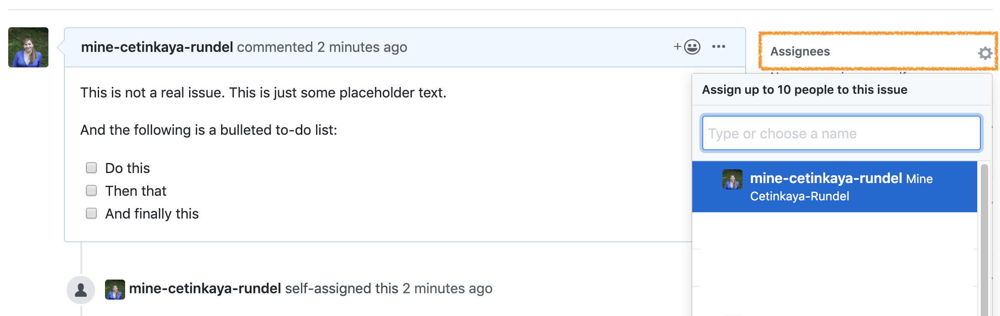
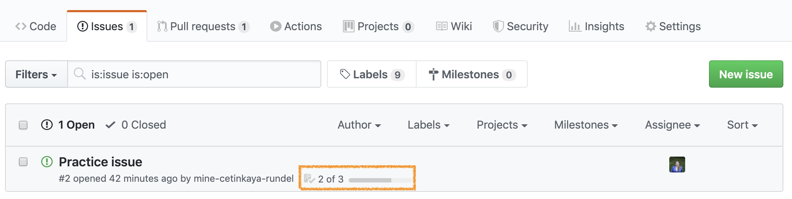
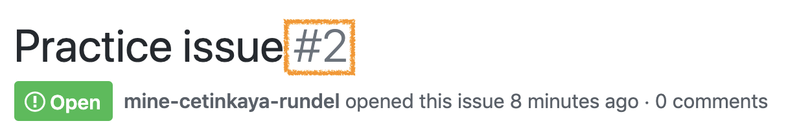

Up to now, you've been working in individual repositories. However, for the project, you will work as a team. This guide will walk you through two aspects of collaborating with GitHub:

* Merges and merge conflicts
* Understanding and working with GitHub issues


## Setup and create your team on GitHub Classroom (this will be the same for the project)

- Accept this sample group GitHub assignment [here](https://classroom.github.com/g/_-UfEZO-)
- **You will select into a team at this point. Make sure only one person in the team names and joins the team first, and then the others join the team after it's been created.** This will create the teams and members, and then you can use the same teams for the actual project repository.
- GitHub will add all of the team members as collaborators for the created repository called `github-collaboration-example-[[teamname]]`


# Merges and merge conflicts

Our first task today is to walk you through a merge conflict!

-   Assign the numbers 1, 2, 3, and 4 to each of the team members. If your team has fewer than 4 people, some people will need to have multiple numbers. If your team has more than 4 people, some people will need to share some numbers.
-   Pushing to a repo replaces the code on GitHub with the code you have on your computer.
-   If a collaborator has made a change to your repo on GitHub that you haven't incorporated into your local work, GitHub will stop you from pushing to the repo because this could overwrite your collaborator's work!
-   So you need to explicitly "merge" your collaborator's work before you can push.
-   If your and your collaborator's changes are in different files or in different parts of the same file, git merges the work for you automatically when you \*pull\*.
-   If you both changed the same part of a file, git will produce a \*\*merge conflict\*\* because it doesn't know how which change you want to keep and which change you want to overwrite.

Git will put conflict markers in your code that look like:

    <<<<<<< HEAD 

    See also: [dplyr documentation](https://dplyr.tidyverse.org/)   

    ======= 

    See also [ggplot2 documentation](https://ggplot2.tidyverse.org/)  

    >>>>>>> some1alpha2numeric3string4

The `===`s separate *your* changes (top) from *their* changes (bottom).

Note that on top you see the word `HEAD`, which indicates that these are your changes.

And at the bottom you see `some1alpha2numeric3string4` (well, it probably looks more like `28e7b2ceb39972085a0860892062810fb812a08f`).

This is the **hash** (a unique identifier) of the commit your collaborator made with the conflicting change.

Your job is to *reconcile* the changes: edit the file so that it incorporates the best of both versions and delete the `<<<`, `===`, and `>>>` lines.
Then you can stage and commit the result.


## Let's cause a merge conflict!

Our goal is to see two different types of merges: first we'll see a type of merge that git can't figure out on its own how to do on its own (a **merge conflict**) and requires human intervention, then another type of where that git can figure out how to do without human intervention.

Doing this will require some tight choreography, so pay attention!

Take turns in completing the exercise, only one member at a time.
**Others should just watch, not doing anything on their own projects (this includes not even pulling changes!)** until they are instructed to.
If you feel like you won't be able to resist the urge to touch your computer when it's not your turn, we recommend putting your hands in your pockets or sitting on them!

**Before starting**: everyone should have the repo cloned and know which role number(s) they are.

**Role 1:**

-   Change the team name to your actual team name.
-   Knit, commit, push.

🛑 Make sure the previous role has finished before moving on to the next step.

**Role 2:**

-   Change the team name to some other word.
-   Knit, commit, push. You should get an error.
-   Pull. Take a look at the document with the merge conflict.
-   Clear the merge conflict by editing the document to choose the correct/preferred change.
-   Knit.
-   **Click the Stage checkbox** for all files in your Git tab. Make sure they all have check marks, not filled-in boxes.
-   Commit and push.

🛑 Make sure the previous role has finished before moving on to the next step.

**Role 3:**

-   Change the a label of the first code chunk
-   Knit, commit, push. You should get an error.
-   Pull. No merge conflicts should occur, but you should see a message about merging.
-   Now push.

🛑 Make sure the previous role has finished before moving on to the next step.

**Role 4:**

-   Change the label of the first code chunk to something other than previous role did.
-   Knit, commit, push. You should get an error.
-   Pull. Take a look at the document with the merge conflict. Clear the merge conflict by choosing the correct/preferred change. Commit, and push.

🛑 Make sure the previous role has finished before moving on to the next step.

**Everyone:** Pull, and observe the changes in your document.

## Tips for collaborating via GitHub

-   Always pull first before you start working.
-   Resolve a merge conflict (commit and push) *before* continuing your work. Never do new work while resolving a merge conflict.
-   Knit, commit, and push often to minimize merge conflicts and/or to make merge conflicts easier to resolve.
-   If you find yourself in a situation that is difficult to resolve, ask questions ASAP. Don't let it linger and get bigger.


# GitHub issues

Issues are a great way to keep track of tasks, enhancements, and bugs for your projects. They're kind of like email---except they can be shared and discussed with the rest of your team. You can use issues as to-do lists as well as a place for brainstorming / discussing ideas.

## Opening an issue

1.  Go to your project repo in GitHub and open a new issue titled "Practice issue".
2.  Add the following text to the issue:

<!-- -->

    This is not a real issue. This is just some placeholder text.

    And the following is a bulleted to-do list:
    - [ ] Do this
    - [ ] Then that
    - [ ] And finally this

3.  Hit preview to make sure the issue looks like the following:

```{r}
knitr::include_graphics("img/practice-issue-create.png")
```

4.  Submit the issue.
5.  Then, assign the issue to one or few members of the team.

```{r}

```

## Working on the issue

As you work on the issue you can check the boxes.

```{r}
knitr::include_graphics("img/practice-issue-check.png")
```

Note that this will also show progress on the issue on the issue dashboard.

```{r}

```

6.  Check some of the boxes on your practice issue and confirm that you can see the progress result on the issue dashboard.

## Closing the issue

Once you're done with an issue, you should close it.
You can do this in one of two ways: on GitHub by clicking on Close issue or via a commit that directly addresses the issue.
We'll practice the second one.
If you preface your commits with "Fixes", "Fixed", "Fix", "Closes", "Closed", or "Close", the issue will be closed when you push the changes to your repo.

7.  Take a note of the issue number, which will show up next to the issue title.

```{r}

```

8.  Go to your project on RStudio and make a change. This can be something silly like adding a new line to the issue README. Then commit this change. In your commit message, use one of the special words listed above and reference the issue. For example, if the change I made was to add a new line to the README I would say something like the following:

<!-- -->

    Add a new line to the README, closes #2

```{r}

```

9.  Push your changes and observe that the issue is now closed on GitHub. Click on the referenced commit to confirm that it was your last commit that closed the issue.

```{r}

```


