class: inverse, center, middle

# Classification review

---

## Confusion Matrix

.center[
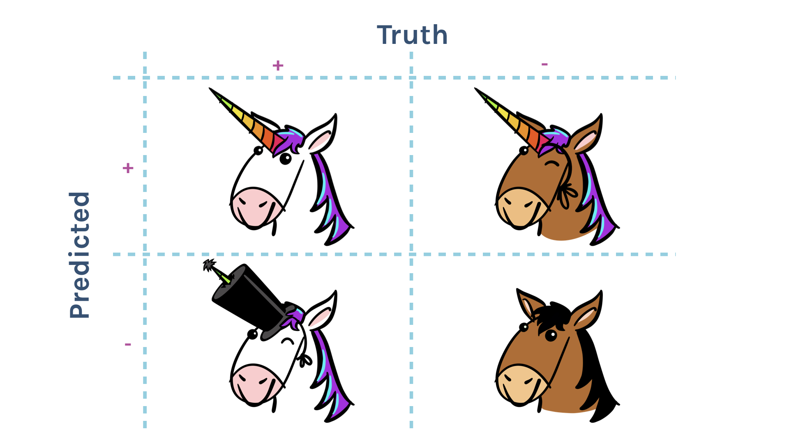
]
---

## Incorrect predictions

.center[

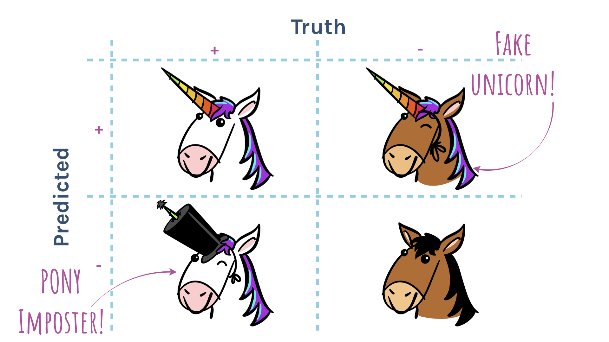
]
---

## Orange:correct, purple:incorrect

.center[

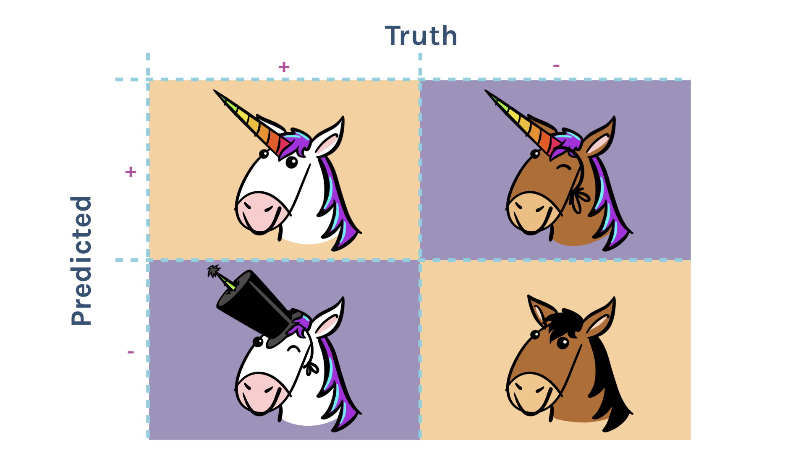
]
---

## Positives and negatives

.center[

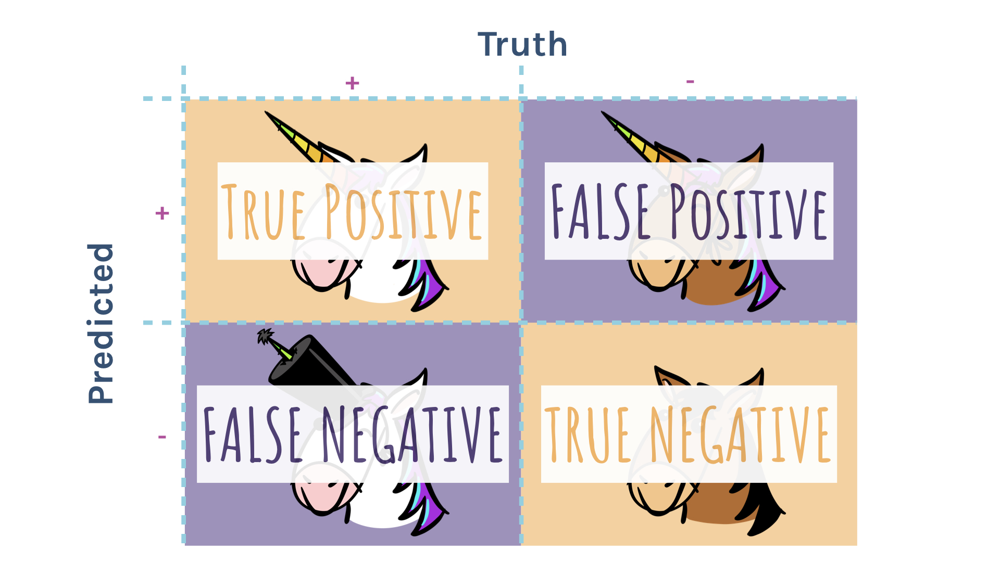
]
---

## Confusion Matrix

.center[

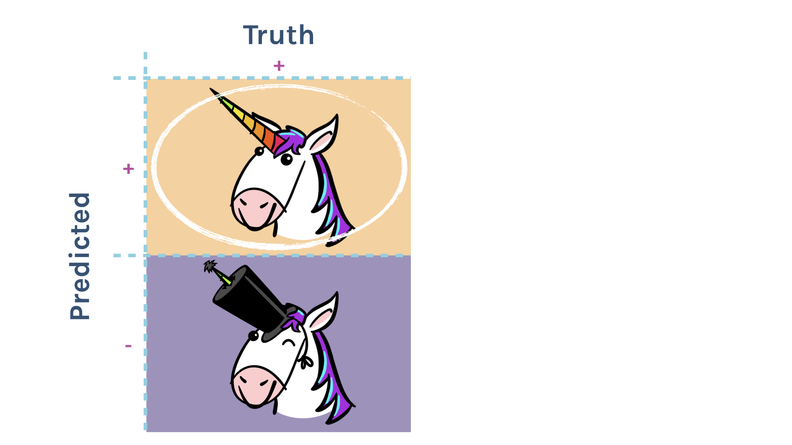
]
---

## Confusion Matrix

.center[

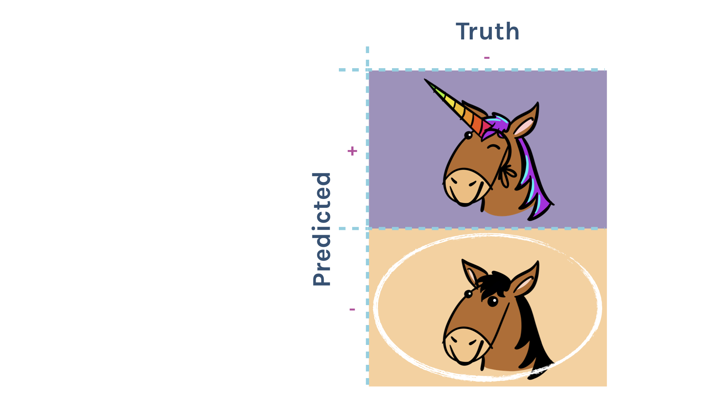
]
---

## Confusion Matrix

.center[

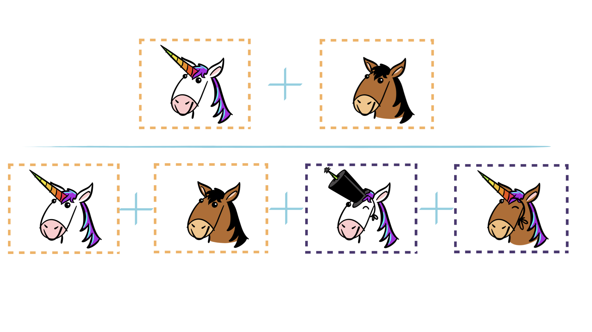
]
---

## Confusion Matrix

.center[

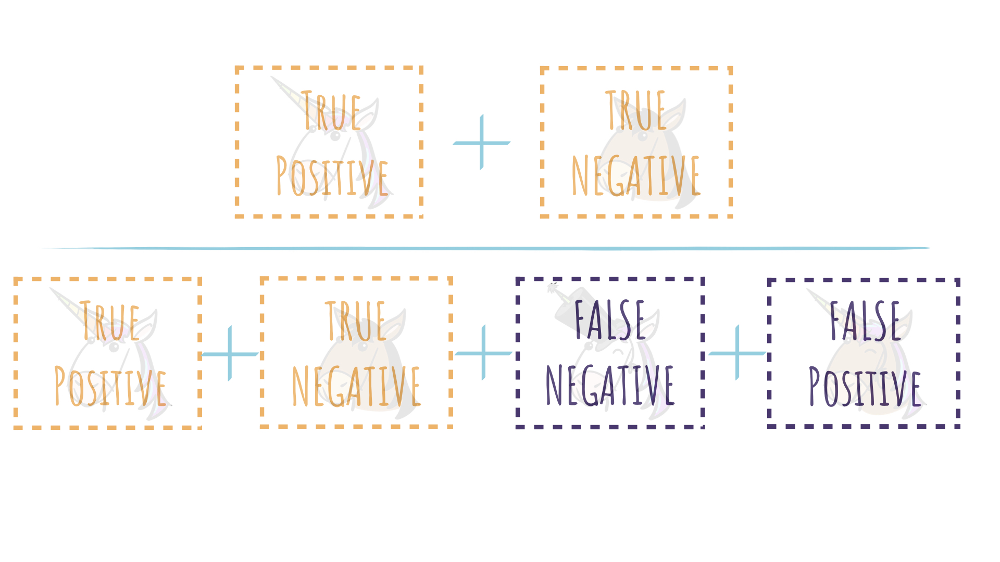
]
---

## Confusion Matrix

.center[
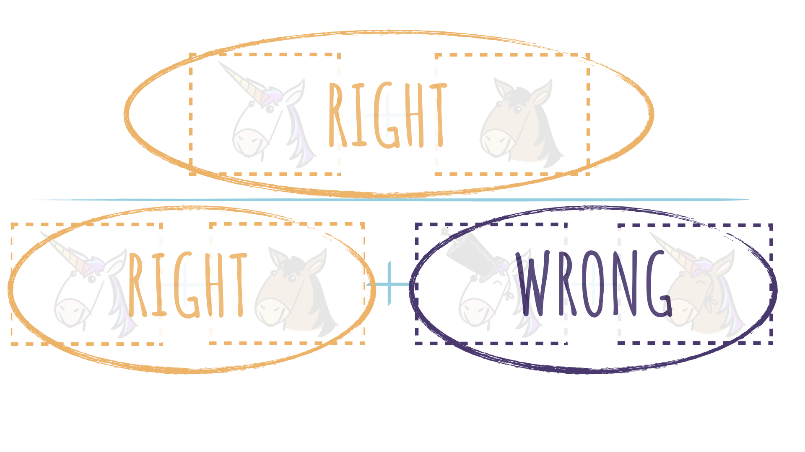
]
---

## Confusion Matrix

.center[

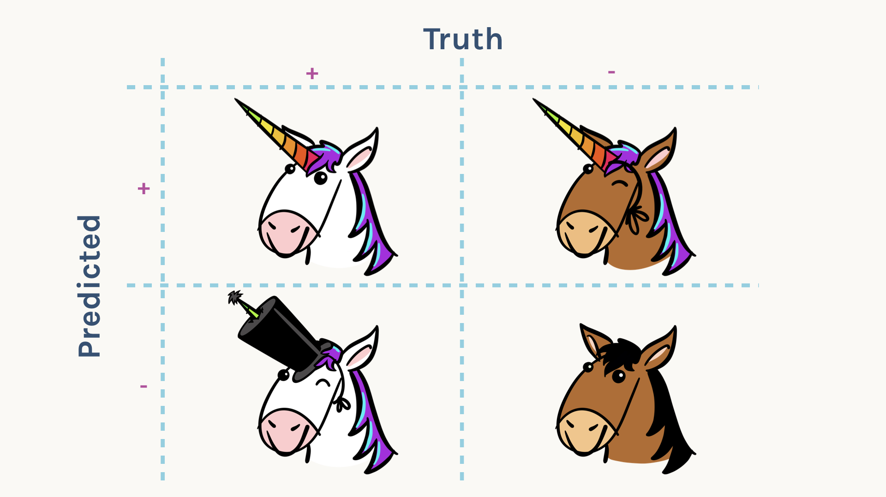
]
---

## Confusion Matrix

.center[

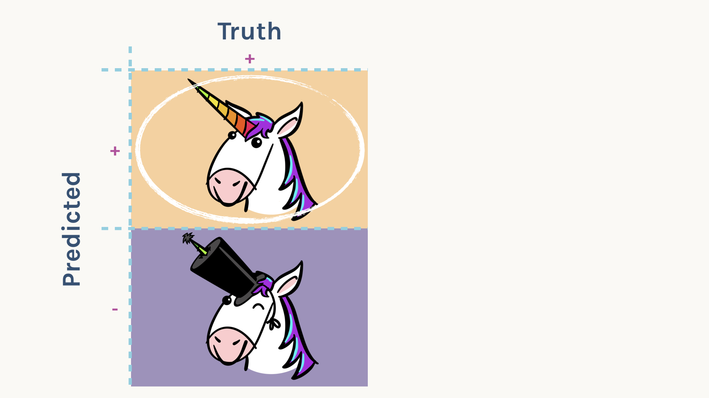
]
---

## Confusion Matrix

.center[

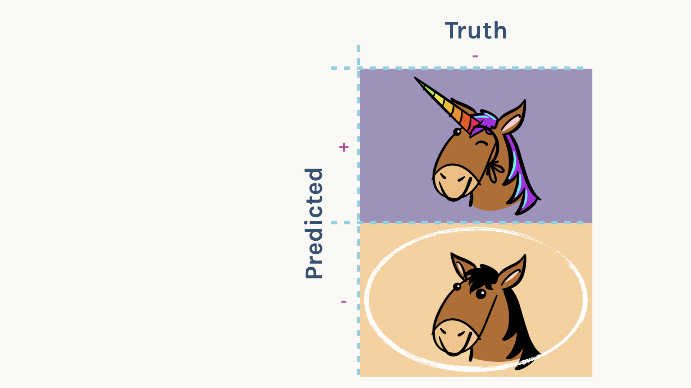
]

---

## Creating the ROC curve (setting different thresholds)

.center[

]

---

## ROC Curve: good? bad?

.center[
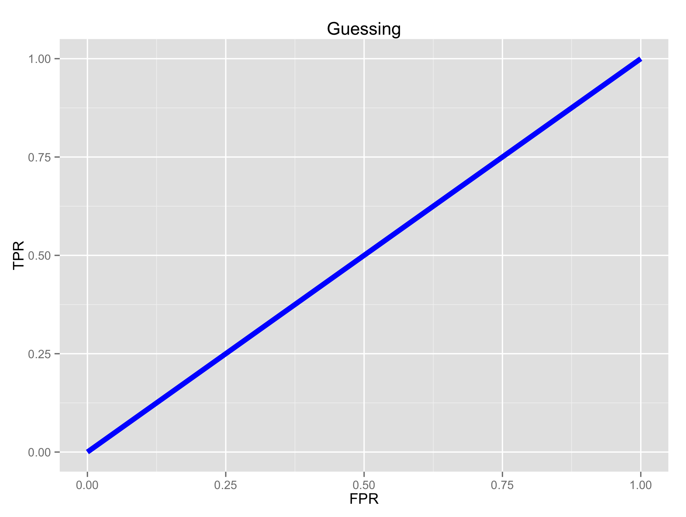
]

---

## ROC Curve: good? bad?

.center[
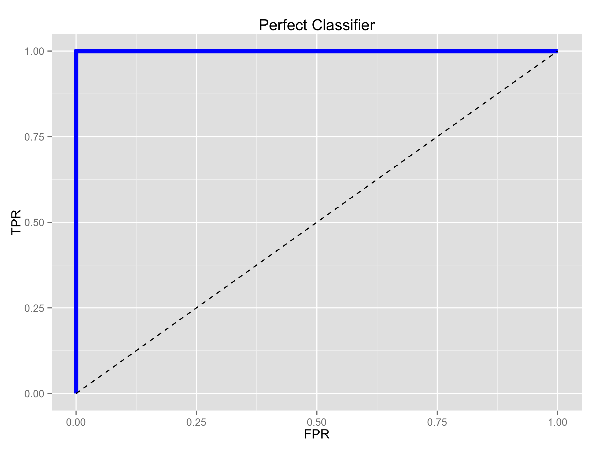
]

---

## ROC Curve: good? bad?

.center[
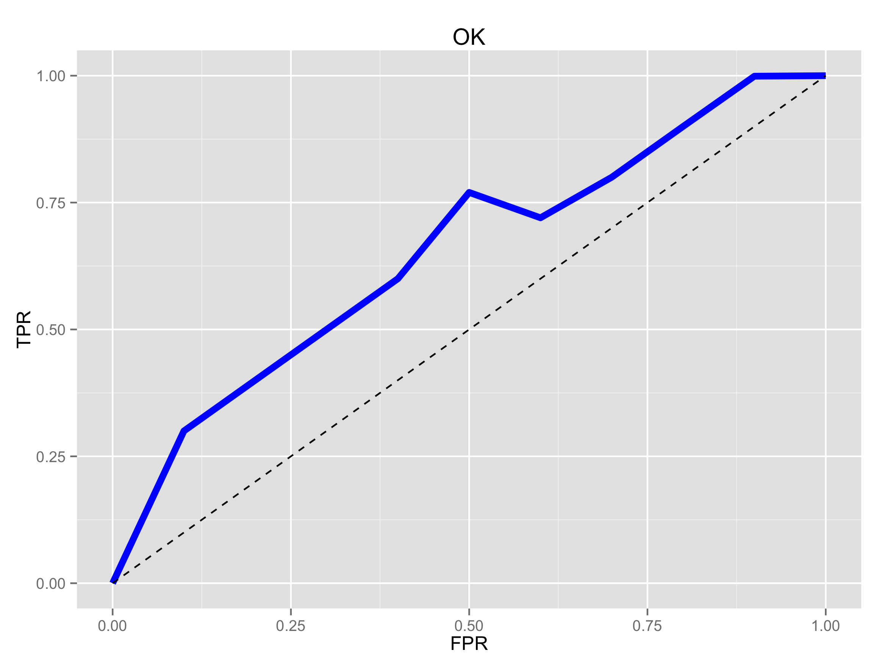
]

---

## ROC Curve: good? bad?

.center[
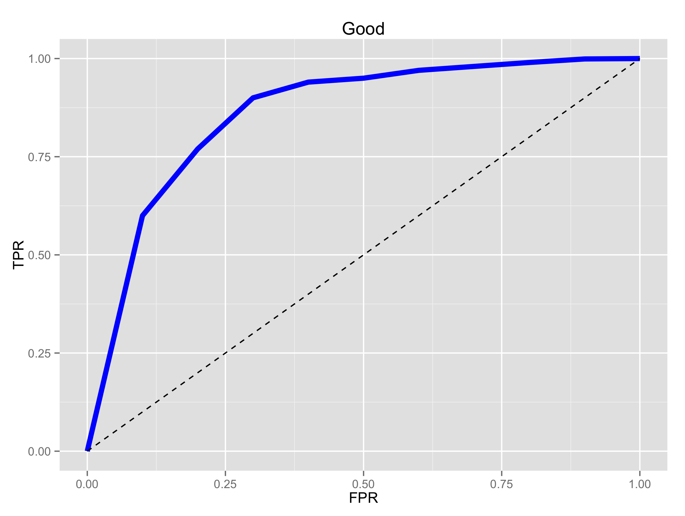
]

