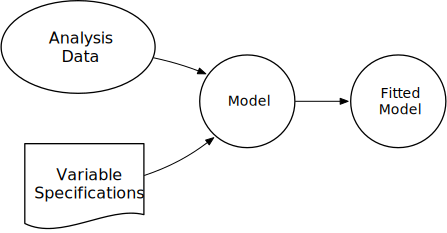
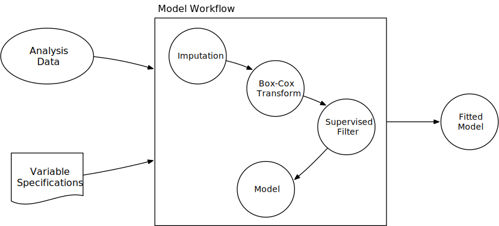

class: inverse, center, middle

# `tidymodels` Review

---

## Why R for Modeling?


.pull-left[
* _R has cutting edge models_. 
  
  Machine learning developers in some domains use R as their primary computing environment and their work often results in R packages.

* _R and R packages are built by people who **do** data analysis_. 

* _The S language is very mature_. 

]

.pull-right[
* _It is easy to port or link to other applications_. 

  R doesn't try to be everything to everyone. If you prefer models implemented in C, C++, `tensorflow`, `keras`, `python`, `stan`, or `Weka`, you can access these applications without leaving R.

* The machine learning environment in R is extremely rich.
]

---

## Downsides to Modeling in R


.pull-left[
* R is a data analysis language and is not C or Java. If a high performance deployment is required, R can be treated like a prototyping language.  

* R is mostly memory-bound. There are plenty of exceptions to this though. 
]

.pull-right[
The main issue is one of _consistency of interface_. For example: 

* There are two methods for specifying what terms are in a model<sup>1</sup>. Not all models have both. 

* 99% of model functions auto-generate dummy variables. 

* Sparse matrices can be used (unless they can't).
]

.footnote[[1] There are now three but the last one is brand new and will be discussed later.]


---

## Syntax for Computing Predicted Class Probabilities

|Function     |Package      |Code                                                 |
|:------------|:------------|:----------------------------------------------------|
|`lda`        |`MASS`       |`predict(obj)`                                       |
|`glm`        |`stats`      |`predict(obj, type = "response")`                    |
|`gbm`        |`gbm`        |`predict(obj, type = "response", n.trees)`           |
|`mda`        |`mda`        |`predict(obj, type = "posterior")`                   |
|`rpart`      |`rpart`      |`predict(obj, type = "prob")`                        |
|`Weka`       |`RWeka`      |`predict(obj, type = "probability")`                 |
|`logitboost` |`LogitBoost` |`predict(obj, type = "raw", nIter)`                  |
|`pamr.train` |`pamr`       |`pamr.predict(obj, type = "posterior", threshold)`   |

We'll see a solution for this later in the class. 


---

## `tidymodels`

.code90[


```r
library(tidymodels)
```

```
## ── Attaching packages ───────────────────────────────────────────────────────────── tidymodels 0.1.1 ──
```

```
## ✓ broom     0.7.0      ✓ recipes   0.1.13
## ✓ dials     0.0.9      ✓ rsample   0.0.8 
## ✓ dplyr     1.0.2      ✓ tibble    3.0.3 
## ✓ ggplot2   3.3.2      ✓ tidyr     1.1.2 
## ✓ infer     0.5.2      ✓ tune      0.1.1 
## ✓ modeldata 0.0.2      ✓ workflows 0.2.0 
## ✓ parsnip   0.1.3      ✓ yardstick 0.0.7 
## ✓ purrr     0.3.4
```

```
## ── Conflicts ──────────────────────────────────────────────────────────────── tidymodels_conflicts() ──
## x purrr::discard() masks scales::discard()
## x dplyr::filter()  masks stats::filter()
## x dplyr::lag()     masks stats::lag()
## x recipes::step()  masks stats::step()
```

]


Plus [`tidypredict`](http://tidypredict.netlify.com/), [`tidyposterior`](https://tidymodels.github.io/tidyposterior/), [`tidytext`](https://github.com/juliasilge/tidytext), and more in development.


---

## Example Data Set - House Prices

For our examples, we will use the Ames IA housing data. There are 2,930 properties in the data. 

The Sale Price was recorded along with 81 predictors, including:

* Location (e.g. neighborhood) and lot information.
* House components (garage, fireplace, pool, porch, etc.).
* General assessments such as overall quality and condition.
* Number of bedrooms, baths, and so on. 

More details can be found in [De Cock (2011, Journal of Statistics Education)](http://ww2.amstat.org/publications/jse/v19n3/decock.pdf).

The raw data are at [`http://bit.ly/2whgsQM`](http://bit.ly/2whgsQM) but we will use a processed version found in the [`modeldata`](https://modeldata.tidymodels.org/reference/ames.html) package. 


---

## Some Example Data Manipulation Code

.font10[


```r
library(tidyverse)

ames_prices <- "http://bit.ly/2whgsQM" %>%
  read_delim(delim = "\t", guess_max = 2000) %>%
  rename_at(vars(contains(' ')), list(~gsub(' ', '_', .))) %>%
  dplyr::rename(Sale_Price = SalePrice) %>%
  dplyr::filter(!is.na(Electrical)) %>%
  dplyr::select(-Order, -PID, -Garage_Yr_Blt)

ames_prices %>%
  group_by(Alley) %>%
  summarize(
    mean_price = mean(Sale_Price / 1000),
    n = sum(!is.na(Sale_Price))
  )
```

```
## # A tibble: 3 x 3
##   Alley mean_price     n
##   <chr>      <dbl> <int>
## 1 Grvl        124.   120
## 2 Pave        177.    78
## 3 <NA>        183.  2731
```

]

---


## Quick Data Investigation

To get warmed up, let's load the real Ames data and do some basic investigations into the variables, such as exploratory visualizations or summary statistics. The idea is to get a feel for the data. 

Let's take 10 minutes to work on your own or with someone next to you. Collaboration is highly encouraged!

To get the data:


```r
library(tidymodels)
data(ames, package = "modeldata")
```


---

## The Modeling _Process_

Common steps during model building are:

* estimating model parameters (i.e. training models)

* determining the values of _tuning parameters_ that cannot be directly calculated from the data

* model selection (within a model type) and model comparison (between types)

* calculating the performance of the final model that will generalize to new data

Many books and courses portray predictive modeling as a short sprint. A better analogy would be a marathon or campaign (depending on how hard the problem is). 


---


# What Are We Doing with the Data?


.pull-left[
We often think of the model as the _only_ real data analysis step in this process.

However, there are other procedures that are often applied before or after the model fit that are data-driven and have an impact. 

]
.pull-right[



]

If we only think of the model as being important, we might end up accidentally overfitting to the data in-hand. This is very similar to the problems of "the garden of forking paths" and ["p-hacking"](http://www.stat.columbia.edu/~gelman/research/unpublished/p_hacking.pdf). 


---

# Define the Data Analysis Process

.pull-left[
Let's conceptualize a process or _workflow_ that involves all of the steps where the data are analyzed in a significant way. This includes the model but might also include other _estimation_ steps. Admittedly, there is some grey area here.

This concept will become important when we talk about measuring performance of the modeling process. 

]
.pull-right[




 * Data preparation steps (e.g. imputation, encoding, transformations, etc)
 
 * Selection of which terms go into the model
]
 
---

# Some naming conventions

There are a few suffixes that we'll use for certain types of objects:

 * `_mod` for a `parsnip` model specification
 
 * `_fit` for a fitted model
 
 * `_rec` for a recipe
 
 * `_wfl` for a workflow
 
 * `_tune` for a tuning object
 
 * `_res` for a general result
 
 

---

# Loading

.code90[


```r
library(tidymodels)
```

```
## ── Attaching packages ───────────────────────────────────────────────────────────── tidymodels 0.1.1 ──
```

```
## ✓ broom     0.7.0      ✓ recipes   0.1.13
## ✓ dials     0.0.9      ✓ rsample   0.0.8 
## ✓ dplyr     1.0.2      ✓ tibble    3.0.3 
## ✓ ggplot2   3.3.2      ✓ tidyr     1.1.2 
## ✓ infer     0.5.2      ✓ tune      0.1.1 
## ✓ modeldata 0.0.2      ✓ workflows 0.2.0 
## ✓ parsnip   0.1.3      ✓ yardstick 0.0.7 
## ✓ purrr     0.3.4
```

```
## ── Conflicts ──────────────────────────────────────────────────────────────── tidymodels_conflicts() ──
## x purrr::discard() masks scales::discard()
## x dplyr::filter()  masks stats::filter()
## x dplyr::lag()     masks stats::lag()
## x recipes::step()  masks stats::step()
```

]


---

# Data Splitting and Spending

How do we "spend" the data to find an optimal model? 

We _typically_ split data into training and test data sets:

*  ***Training Set***: these data are used to estimate model parameters and to pick the values of the complexity parameter(s) for the model.

*  ***Test Set***: these data can be used to get an independent assessment of model efficacy. They should not be used during model training. 


---

# Mechanics of Data Splitting

There are a few different ways to do the split: simple random sampling, _stratified sampling based on the outcome_, by date, or methods that focus on the distribution of the predictors.

For stratification:

* **Classification**: 

  This would mean sampling within the classes to preserve the distribution of the outcome in the training and test sets.

* **Regression**:

  Determine the quartiles of the data set and sample within those artificial groups.


---

# Ames Housing Data 

It makes a lot of sense to model the sale price in log units. It stabilizes the variance and prevents the prediction of negative values. 

Let's load the example data set and split it. We'll put 75% into training and 25% into testing. 


```r
# rsample and modeldata are loaded with tidymodels package
data(ames, package = "modeldata")
ames <- ames %>% mutate(Sale_Price = log10(Sale_Price))

# Make sure that you get the same random numbers
set.seed(4595)
data_split <- initial_split(ames, strata = "Sale_Price")

ames_train <- training(data_split)
ames_test  <- testing(data_split)

nrow(ames_train)/nrow(ames)
```

```
## [1] 0.7505119
```
???

The select statement removes subjective quality scores which, to me, seems
like it should be an outcome and not a predictor. 

---

# Ames Housing Data

What do these objects look like?


```r
# result of initial_split()
# <training / testing / total>
data_split
```

```
## <Analysis/Assess/Tota>
## <2199/731/2930>
```


```r
training(data_split)
```


```r
## # A tibble: 2,199 x 81
##    MS_SubClass MS_Zoning Lot_Frontage Lot_Area Street Alley Lot_Shape Land_Contour Utilities Lot_Config Land_Slope
##    <fct>       <fct>            <dbl>    <int> <fct>  <fct> <fct>     <fct>        <fct>     <fct>      <fct>     
##  1 One_Story_… Resident…          141    31770 Pave   No_A… Slightly… Lvl          AllPub    Corner     Gtl       
##  2 Two_Story_… Resident…           74    13830 Pave   No_A… Slightly… Lvl          AllPub    Inside     Gtl       
##  3 Two_Story_… Resident…           78     9978 Pave   No_A… Slightly… Lvl          AllPub    Inside     Gtl       
##  4 One_Story_… Resident…           43     5005 Pave   No_A… Slightly… HLS          AllPub    Inside     Gtl       
##  5 One_Story_… Resident…           39     5389 Pave   No_A… Slightly… Lvl          AllPub    Inside     Gtl       
## # … and many more rows and columns
## # …
```


---

class: inverse, middle, center

#  Creating Models in R


---

# Specifying Models in R Using Formulas

To fit a model to the housing data, the model terms must be specified. Historically, there are two main interfaces for doing this. The **formula** interface uses R [formula rules](https://cran.r-project.org/doc/manuals/r-release/R-intro.html#Formulae-for-statistical-models) to specify a _symbolic_ representation of the terms:

.pull-left-a-lot[

Variables + interactions


```r
model_fn(
  Sale_Price ~ Neighborhood + Year_Sold + Neighborhood:Year_Sold,
  data = ames_train
)
```


Inline functions / transformations


```r
# If we had not already logged Sale_Price
model_fn(
  log10(Sale_Price) ~ ns(Longitude, df = 3) + ns(Latitude, df = 3),
  data = ames_train
)
```

]

.pull-right-a-little[

Shorthand for all predictors


```r
model_fn(
  Sale_Price ~ .,
  data = ames_train
)
```

This is very convenient but it has some disadvantages.

]

---

# Downsides to Formulas

* You can't nest in-line functions such as 

```r
model_fn(y ~ pca(scale(x1), scale(x2), scale(x3)), data = dat)
```

* All the model matrix calculations happen at once and can't be recycled when used in a model function. 

* For very _wide_ data sets, the formula method can be [extremely inefficient](https://rviews.rstudio.com/2017/03/01/the-r-formula-method-the-bad-parts/). 

* There are limited _roles_ that variables can take which has led to several re-implementations of formulas. 

* Specifying multivariate outcomes is clunky and inelegant.

* Not all modeling functions have a formula method (consistency!). 

---

# Specifying Models Without Formulas

Some modeling function have a non-formula (XY) interface. This usually has arguments for the predictors and the outcome(s):


```r
# Usually, the variables must all be numeric
pre_vars <- c("Year_Sold", "Longitude", "Latitude")

model_fn(x = ames_train[, pre_vars], y = ames_train$Sale_Price)
```

This is inconvenient if you have transformations, factor variables, interactions, or any other operations to apply to the data prior to modeling. 

Overall, it is difficult to predict if a package has one or both of these interfaces. For example, `lm()` only has formulas. 

There is a **third interface**, using _recipes_ that will be discussed later that solves some of these issues. 

---

# A Linear Regression Model

Let's start by fitting an ordinary linear regression model to the training set. You can choose the model terms for your model, but I will use a very simple model:


```r
simple_lm <- lm(Sale_Price ~ Longitude + Latitude, data = ames_train)
```

Before looking at coefficients, we should do some model checking to see if there is anything obviously wrong with the model. 

To get the statistics on the individual data points, we will use the awesome `broom` package:


```r
simple_lm_values <- augment(simple_lm)
names(simple_lm_values)
```

```
## [1] "Sale_Price" "Longitude"  "Latitude"   ".fitted"    ".resid"    
## [6] ".std.resid" ".hat"       ".sigma"     ".cooksd"
```

---

# A Linear Regression Model


```r
head(simple_lm_values, n = 2)
```

```
## # A tibble: 2 x 9
##   Sale_Price Longitude Latitude .fitted  .resid .std.resid    .hat .sigma
##        <dbl>     <dbl>    <dbl>   <dbl>   <dbl>      <dbl>   <dbl>  <dbl>
## 1       5.24     -93.6     42.1    5.23 0.00920     0.0565 0.00127  0.163
## 2       5.39     -93.6     42.1    5.22 0.169       1.04   0.00127  0.163
## # … with 1 more variable: .cooksd <dbl>
```

After working with the individual data points, you can move on to the coefficients themselves. `tidy()` extracts the coefficients from the model. `glance()` summarizes a model fit's overarching metrics.

.pull-left-a-lot[


```r
tidy(simple_lm)
```

```
## # A tibble: 3 x 5
##   term        estimate std.error statistic  p.value
##   <chr>          <dbl>     <dbl>     <dbl>    <dbl>
## 1 (Intercept)  -307.      15.1       -20.3 2.39e-84
## 2 Longitude      -2.03     0.134     -15.1 2.41e-49
## 3 Latitude        2.89     0.190      15.3 5.43e-50
```

]

.pull-right-a-little[


```r
# But don't trust this too much!
glance(simple_lm)[1:3]
```

```
## # A tibble: 1 x 3
##   r.squared adj.r.squared sigma
##       <dbl>         <dbl> <dbl>
## 1     0.170         0.169 0.163
```

]

---

# parsnip

- A tidy unified _interface_ to models

- `lm()` isn't the only way to perform linear regression
  
  - `glmnet` for regularized regression
  
  - `stan` for Bayesian regression
  
  - `keras` for regression using tensorflow
  
  - `spark` for large data sets
  
- But...remember the consistency slide?

  - Each interface has its own minutae to remember
  
---

# parsnip in Action

.pull-left[

1) Create a specification

2) Set the engine

3) Fit the model


```r
spec_lin_reg <- linear_reg()
spec_lin_reg
```

```
## Linear Regression Model Specification (regression)
```

```r
lm_mod <- set_engine(spec_lin_reg, "lm")
lm_mod
```

```
## Linear Regression Model Specification (regression)
## 
## Computational engine: lm
```

]

.pull-right[


```r
lm_fit <- fit(
  lm_mod,
  Sale_Price ~ Longitude + Latitude,
  data = ames_train
)

lm_fit
```

```
## parsnip model object
## 
## Fit time:  2ms 
## 
## Call:
## stats::lm(formula = Sale_Price ~ Longitude + Latitude, data = data)
## 
## Coefficients:
## (Intercept)    Longitude     Latitude  
##    -306.688       -2.032        2.893
```

]

---

# Different interfaces

`parsnip` is not picky about the interface used to specify terms. Remember, `lm()` only allowed the formula interface!


```r
fit_xy(
  lm_mod,
  y = ames_train %>% dplyr::pull(Sale_Price),
  x = ames_train %>% dplyr::select(Latitude, Longitude)
)
```

```
## parsnip model object
## 
## Fit time:  1ms 
## 
## Call:
## stats::lm(formula = ..y ~ ., data = data)
## 
## Coefficients:
## (Intercept)     Latitude    Longitude  
##    -306.688        2.893       -2.032
```

---

# Alternative Engines

With `parsnip`, it is easy to switch to a different engine, like Stan, to run the
same model with alternative backends.

.pull-left[


```r
spec_stan <- 
  spec_lin_reg %>%
  # Engine specific arguments are passed through here
  set_engine("stan", chains = 4, iter = 1000)

# Otherwise, looks exactly the same!
fit_stan <- fit(
  spec_stan,
  Sale_Price ~ Longitude + Latitude,
  data = ames_train
)
```

]

.pull-right[


```r
coef(fit_stan$fit)
```

```
## (Intercept)   Longitude    Latitude 
## -306.283736   -2.029816    2.887020
```

```r
coef(lm_fit$fit)
```

```
## (Intercept)   Longitude    Latitude 
## -306.688470   -2.032306    2.892838
```

]


---

# Different models

Switching _between_ models is easy since the interfaces are homogenous. 

For example, to fit a 5-nearest neighbor model:


```r
fit_knn <- 
  nearest_neighbor(mode = "regression", neighbors = 5) %>%
  set_engine("kknn") %>% 
  fit(Sale_Price ~ Longitude + Latitude, data = ames_train)

fit_knn
```

```
## parsnip model object
## 
## Fit time:  26ms 
## 
## Call:
## kknn::train.kknn(formula = Sale_Price ~ Longitude + Latitude,     data = data, ks = ~5)
## 
## Type of response variable: continuous
## minimal mean absolute error: 0.06753097
## Minimal mean squared error: 0.009633708
## Best kernel: optimal
## Best k: 5
```

---

class: middle, center

# Now that we have fit a model on the _training_ set, 
# is it time to make predictions on the _test_ set?

---


---

# DANGER

.pull-left[

In general, we would **not** want to predict the test set at this point, although we will do so to illustrate how the code works.

In a real scenario, we would use _resampling_ methods (e.g. cross-validation, bootstrapping, etc) or a validation set to evaluate how well the model is doing. 

]
.pull-right[


]

`tidymodels` has a great infrastructure to do this with `rsample`, and we will talk about this soon to demonstrate how we should _really_ evaluate models. 

---

# Predictions

For now, let's compute predictions and performance measures on the test set:

.pull-left[


```r
# Numeric predictions always in a df
# with column `.pred`
test_pred <- 
  lm_fit %>%
  predict(ames_test) %>%
  bind_cols(ames_test) 

test_pred %>% 
  dplyr::select(Sale_Price, .pred) %>% 
  slice(1:3)
```

```
## # A tibble: 3 x 2
##   Sale_Price .pred
##        <dbl> <dbl>
## 1       5.33  5.23
## 2       5.02  5.23
## 3       5.27  5.27
```
]

.pull-right[

`parsnip` tools are very standardized. 

 * `predict()` always produces a tibble with a row for each row of `new_data`. 
 
 * The column names are also [predictable](https://tidymodels.github.io/parsnip/reference/predict.model_fit.html#value). For (univariate) regression predictions, the prediction column is always `.pred`. 

]

So, for the KNN model, just change the argument to `fit_knn` and everything works.

---

# Estimating Performance


.pull-left[
The `yardstick` package is a tidy interface for computing measures of performance. 

There are individual functions for specific metrics (e.g. `accuracy()`, `rmse()`, etc.).

When more than one metric is desired, `metric_set()` can create a new function that wraps them. 

Note that these metric functions work with `group_by()`. 
]
.pull-right[


```r
# yardstick loaded by tidymodels

perf_metrics <- metric_set(rmse, rsq, ccc)

# A tidy result back:
test_pred  %>% 
  perf_metrics(truth = Sale_Price, estimate = .pred)
```

```
## # A tibble: 3 x 3
##   .metric .estimator .estimate
##   <chr>   <chr>          <dbl>
## 1 rmse    standard       0.155
## 2 rsq     standard       0.181
## 3 ccc     standard       0.306
```

There are sometimes different ways to [estimate these statistics](https://tidymodels.github.io/yardstick/articles/multiclass.html); `.estimator` is not always "standard". 

]

