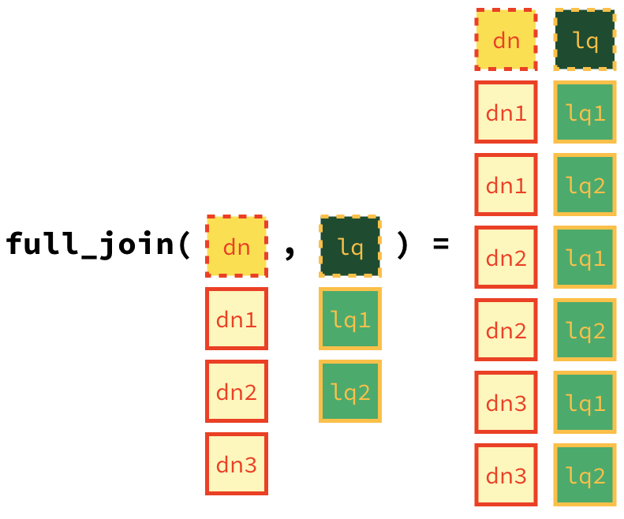

```{r include = FALSE}
knitr::opts_chunk$set(eval = FALSE)
```

```{r fig.margin = TRUE, echo = FALSE}

```

Have you ever taken a road trip in the US and thought to yourself "I wonder what La Quinta means".
Well, the late comedian [Mitch Hedberg](https://en.wikipedia.org/wiki/Mitch_Hedberg) thinks it's Spanish for *next to Denny's*.

If you're not familiar with these two establishments, [Denny's](https://www.dennys.com/) is a casual diner chain that is open 24 hours and [La Quinta Inn and Suites](http://www.lq.com/) is a hotel chain.

These two establishments tend to be clustered together, or at least this observation is a joke made famous by Mitch Hedberg.
In this lab we explore the validity of this joke and along the way learn some more data wrangling and tips for visualizing spatial data.

The inspiration for this lab comes from a blog post by John Reiser on his *new jersey geographer* blog.
You can read that analysis [here](http://njgeo.org/2014/01/30/mitch-hedberg-and-gis/).
Reiser's blog post focuses on scraping data from Denny's and La Quinta Inn and Suites websites using Python.
In this lab we focus on visualization and analysis of these data.
However note that the data scraping was also done in R, and we we will discuss web scraping using R later in the course.
But for now we focus on the data that has already been scraped and tidied for you.

# Learning goals

-   Visualising spatial data
-   Joining data frames

# Getting started

- [Click here to go the the Lab in Canvas](https://georgetown.instructure.com/courses/126656/assignments/572747)
- Click on the link inside the assignment to go to the acceptance page. You should see something like the following screen, but the name of the repository that will be created is `lab-4-YOURGITHUBUSERNAME`:
- Grab the URL of the repo, and clone it in RStudio.
- Open the R Markdown document `lab-04.Rmd` and Knit it.
- Make sure it compiles without errors.
- The output will be in the file markdown `.md` file with the same name.

## Warm up

Before we introduce the data, let's warm up with some simple exercises.

-   Update the YAML, changing the author name to your name, and **knit** the document.
-   Commit your changes with a meaningful commit message.
-   Push your changes to GitHub.
-   Go to your repo on GitHub and confirm that your changes are visible in your Rmd **and** md files. If anything is missing, commit and push again.

## Packages

We'll use the **tidyverse** package for much of the data wrangling and visualisation and the data lives in the **dsbox** package.
These packages are already installed for you.
You can load them by running the following in your Console:

```{r message = FALSE}
library(tidyverse) 
library(dsbox) 
```

## Data

The datasets we'll use are called `dennys` and `laquinta` from the **dsbox** package.
Note that these data were scraped from [here](https://locations.dennys.com/) and [here](https://www.lq.com/en/findandbook/hotel-listings.html), respectively.

The datasets we'll use are called `dennys` and `laquinta` from the **dsbox** package.
Since the datasets are distributed with the package, we don't need to load them separately; they become available to us when we load the package.
You can find out more about the datasets by inspecting their documentation, which you can access by running `?dennys` and `?laquinta` in the Console or using the Help menu in RStudio to search for `dennys` or `laquinta`.
You can also find this information [here](https://rstudio-education.github.io/dsbox/reference/dennys.html) and [here](https://rstudio-education.github.io/dsbox/reference/laquinta.html).

To help with our analysis we will also use a dataset on US states, which is located in your repository's `data` folder.

```{r}
states <- read_csv("data/states.csv")
```

Each observation in this dataset represents a state, including DC.
Along with the name of the state we have the two-letter abbreviation and we have the geographic area of the state (in square miles).

# Part I Exercises

1.  What are the dimensions of the Denny's dataset?
    (Hint: Use inline R code and functions like `nrow` and `ncol` to compose your answer.) What does each row in the dataset represent?
    What are the variables?

2.  What are the dimensions of the La Quinta's dataset?
    What does each row in the dataset represent?
    What are the variables?

🧶 ✅ ⬆️ Knit, *commit, and push your changes to GitHub with an appropriate commit message. Make sure to commit and push all changed files so that your Git pane is cleared up afterwards.*

We would like to limit our analysis to Denny's and La Quinta locations in the United States.

3.  Take a look at the websites that the data come from (linked above).
    Are there any La Quinta's locations outside of the US?
    If so, which countries?
    What about Denny's?

4.  Now take a look at the data.
    What would be some ways of determining whether or not either establishment has any locations outside the US using just the data (and not the websites).
    Don't worry about whether you know how to implement this, just brainstorm some ideas.
    Write down at least one as your answer, but you're welcomed to write down a few options too.

We will determine whether or not the establishment has a location outside the US using the `state` variable in the `dn` and `lq` datasets.
We know exactly which states are in the US, and we have this information in the `states` dataframe we loaded.

5.  Find the Denny's locations that are outside the US, if any. To do so, filter the Denny's locations for observations where `state` is not in `states$abbreviation`. The code for this is given below. Note that the `%in%` operator matches the states listed in the `state` variable to those listed in `states$abbreviation`. The `!` operator means **not**. Are there any Denny's locations outside the US?

```{marginfigure}
"Filter for `state`s that are not in `states$abbreviation`."
```

```{r}
dn %>%
  filter(!(state %in% states$abbreviation))
```

6.  Add a country variable to the Denny's dataset and set all observations equal to `"United States"`. Remember, you can use the `mutate` function for adding a variable. Make sure to save the result of this as `dn` again so that the stored data frame contains the new variable going forward.

```{marginfigure}
We don't need to tell R how many times to repeat the character string "United States" to fill in the data for all observations, R takes care of that automatically.
```

```{r}
dn %>%
  mutate(country = "United States")
```

7.  Find the La Quinta locations that are outside the US, and figure out which country they are in.
    This might require some googling.
    Take notes, you will need to use this information in the next exercise.

8.  Add a country variable to the La Quinta dataset.
    Use the `case_when` function to populate this variable.
    You'll need to refer to your notes from Exercise 7 about which country the non-US locations are in.
    Here is some starter code to get you going:

```{r eval = FALSE}
lq %>%
  mutate(country = case_when(
    state %in% state.abb     ~ "United States",
    state %in% c("ON", "BC") ~ "Canada",
    state == "ANT"           ~ "Colombia",
    ...                      # fill in the rest
  ))
```

🧶 ✅ ⬆️ Knit, *commit, and push your changes to GitHub with an appropriate commit message. Make sure to commit and push all changed files so that your Git pane is cleared up afterwards.*

Going forward we will work with the data from the United States only.
All Denny's locations are in the United States, so we don't need to worry about them.
However we do need to filter the La Quinta dataset for locations in United States.

```{r}
lq <- lq %>%
  filter(country == "United States")
```

9.  Which states have the most and fewest Denny's locations? What about La Quinta? Is this surprising? Why or why not?

Next, let's calculate which states have the most Denny's locations *per thousand square miles*.
This requires *joinining* information from the frequency tables you created in Exercise 8 with information from the `states` data frame.

First, we count how many observations are in each state, which will give us a data frame with two variables: `state` and `n`.
Then, we join this data frame with the `states` data frame.
However note that the variables in the `states` data frame that has the two-letter abbreviations is called `abbreviation`.
So when we're joining the two data frames we specify that the `state` variable from the Denny's data should be matched `by` the `abbreviation` variable from the `states` data:

```{r}
dn %>%
  count(state) %>%
  inner_join(states, by = c("state" = "abbreviation"))
```

Before you move on the the next question, run the code above and take a look at the output.
In the next exercise you will need to build on this pipe.

10. Which states have the most Denny's locations per thousand square miles? What about La Quinta?

Next, we put the two datasets together into a single data frame.
However before we do so, we need to add an identifier variable.
We'll call this `establishment` and set the value to `"Denny's"` and `"La Quinta"` for the `dn` and `lq` data frames, respectively.

```{r}
dn <- dn %>%
  mutate(establishment = "Denny's")
lq <- lq %>%
  mutate(establishment = "La Quinta")
```

Since the two data frames have the same columns, we can easily bind them with the `bind_rows` function:

```{r}
dn_lq <- bind_rows(dn, lq)
```

We can plot the locations of the two establishments using a scatter plot, and color the points by the establishment type.
Note that the latitude is plotted on the x-axis and the longitude on the y-axis.

```{r}
ggplot(dn_lq, mapping = aes(x = longitude, y = latitude, color = establishment)) +
  geom_point()
```

The following two questions ask you to create visualizations.
These should follow best practices you learned in class, such as informative titles, axis labels, etc.
See <http://ggplot2.tidyverse.org/reference/labs.html> for help with the syntax.
You can also choose different themes to change the overall look of your plots, see <http://ggplot2.tidyverse.org/reference/ggtheme.html> for help with these.

11. Filter the data for observations in North Carolina only, and recreate the plot.
    You should also adjust the transparency of the points, by setting the `alpha` level, so that it's easier to see the overplotted ones.
    Visually, does Mitch Hedberg's joke appear to hold here?

12. Now filter the data for observations in Texas only, and recreate the plot, with an appropriate `alpha` level.
    Visually, does Mitch Hedberg's joke appear to hold here?

# Part II Exercises 


1.  Filter the Denny's dataframe for Alaska (AK) and save the result as `dn_ak`. How many Denny's locations are there in Alaska?

```{r}
dn_ak <- dennys %>%
  filter(state == "AK")
nrow(dn_ak)
```

2.  Filter the La Quinta dataframe for Alaska (AK) and save the result as `lq_ak`. How many La Quinta locations are there in Alaska?

```{r}
lq_ak <- laquinta %>%
  filter(state == "AK")
nrow(lq_ak)
```

Next we'll calculate the distance between all Denny's and all La Quinta locations in Alaska.
Let's take this step by step:

**Step 1:** There are 3 Denny's and 2 La Quinta locations in Alaska.
(If you answered differently above, you might want to recheck your answers.)

{width="300px" height="300px"}

**Step 2:** Let's focus on the first Denny's location.
We'll need to calculate two distances for it: (1) distance between Denny's 1 and La Quinta 1 and (2) distance between Denny's 1 and La Quinta (2).

{width="300px" height="150px"}

**Step 3:** Now let's consider all Denny's locations.

{width="300px" height="450px"}

3.  How many pairings are there between all Denny's and all La Quinta locations in Alaska, i.e. how many distances do we need to calculate between the locations of these establishments in Alaska?

In order to calculate these distances we need to first restructure our data to pair the Denny's and La Quinta locations.
To do so, we will join the two data frames.
We have six join options in R.
Each of these join functions take at least three arguments: `x`, `y`, and `by`.

-   `x` and `y` are data frames to join
-   `by` is the variable(s) to join by

Four of these join functions combine variables from the two data frames:

```{marginfigure}
These are called **mutating joins**.
```

-   `inner_join()`: return all rows from `x` where there are matching values in `y`, and all columns from `x` and `y`.

-   `left_join()`: return all rows from `x`, and all columns from `x` and `y`.
    Rows in x with no match in y will have NA values in the new columns.

-   `right_join()`: return all rows from `y`, and all columns from `x` and `y`.
    Rows in y with no match in x will have NA values in the new columns.

-   `full_join()`: return all rows and all columns from both `x` and `y`.
    Where there are not matching values, returns NA for the one missing.

And the other two join functions only keep cases from the left-hand data frame, and are called **filtering joins**.
We'll learn about these another time but you can find out more about the join functions in the help files for any one of them, e.g. `?full_join`.

In practice we mostly use mutating joins.
In this case we want to keep all rows and columns from both `dn_ak` and `lq_ak` data frames.
So we will use a `full_join`.

{height="300px" width="300px"}

Let's join the data on Denny's and La Quinta locations in Alaska, and take a look at what it looks like:

```{r}
dn_lq_ak <- full_join(dn_ak, lq_ak, by = "state")
dn_lq_ak
```

4.  How many observations are in the joined `dn_lq_ak` data frame? What are the names of the variables in this data frame.

`.x` in the variable names means the variable comes from the `x` data frame (the first argument in the `full_join` call, i.e. `dn_ak`), and `.y` means the variable comes from the `y` data frame.
These varibles are renamed to include `.x` and `.y` because the two data frames have the same variables and it's not possible to have two variables in a data frame with the exact same name.

Now that we have the data in the format we wanted, all that is left is to calculate the distances between the pairs.

🧶 ✅ ⬆️ Knit, *commit, and push your changes to GitHub with an appropriate commit message. Make sure to commit and push all changed files so that your Git pane is cleared up afterwards.*

5.  What function from the tidyverse do we use the add a new variable to a data frame while keeping the existing variables?

One way of calculating the distance between any two points on the earth is to use the Haversine distance formula.
This formula takes into account the fact that the earth is not flat, but instead spherical.

This function is not available in R, but we have it saved in a file called `haversine.R` that we can load and then use:

```{r}
haversine <- function(long1, lat1, long2, lat2, round = 3) {
  # convert to radians
  long1 = long1 * pi / 180
  lat1  = lat1  * pi / 180
  long2 = long2 * pi / 180
  lat2  = lat2  * pi / 180
  
  R = 6371 # Earth mean radius in km
  
  a = sin((lat2 - lat1)/2)^2 + cos(lat1) * cos(lat2) * sin((long2 - long1)/2)^2
  d = R * 2 * asin(sqrt(a))
  
  return( round(d,round) ) # distance in km
}
```

This function takes five arguments:

-   Longitude and latitude of the first location
-   Longitude and latitude of the second location
-   A parameter by which to round the responses

6.  Calculate the distances between all pairs of Denny's and La Quinta locations and save this variable as `distance`.
    Make sure to save this variable in THE `dn_lq_ak` data frame so that you can use it later.

7.  Calculate the minimum distance between a Denny's and La Quinta for each Denny's location.
    To do so we group by Denny's locations and calculate a new variable that stores the information for the minimum distance.

```{r eval = FALSE}
dn_lq_ak_mindist <- dn_lq_ak %>%
  group_by(address.x) %>%
  summarise(closest = min(distance))
```

8.  Describe the distribution of the distances Denny's and the nearest La Quinta locations in Alaska. Also include an appripriate visualization and relevant summary statistics.

🧶 ✅ ⬆️ Knit, *commit, and push your changes to GitHub with an appropriate commit message. Make sure to commit and push all changed files so that your Git pane is cleared up afterwards.*

9.  Repeat the same analysis for North Carolina: (i) filter Denny's and La Quinta Data Frames for NC, (ii) join these data frames to get a completelist of all possible pairings, (iii) calculate the distances between all possible pairings of Denny's and La Quinta in NC, (iv) find the minimum distance between each Denny's and La Quinta location, (v) visualize and describe the distribution of these shortest distances using appropriate summary statistics.

10. Repeat the same analysis for Texas.

11. Repeat the same analysis for a state of your choosing, different than the ones we covered so far.

12. Among the states you examined, where is Mitch Hedberg's joke most likely to hold true?
    Explain your reasoning.

🧶 ✅ ⬆️ Knit, *commit, and push your changes to GitHub with an appropriate commit message. Make sure to commit and push all changed files so that your Git pane is cleared up afterwards and review the md document on GitHub to make sure you're happy with the final state of your work.*


That's it for now!
In the next lab we will take a more quantitative approach to answering these questions.

