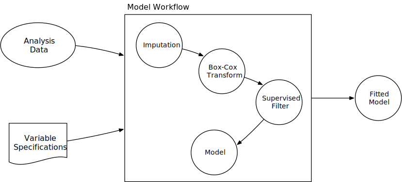
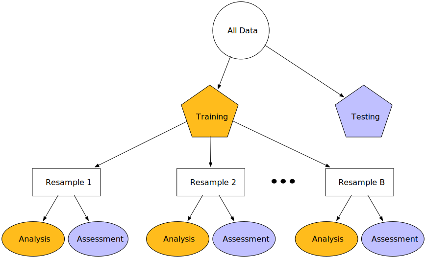
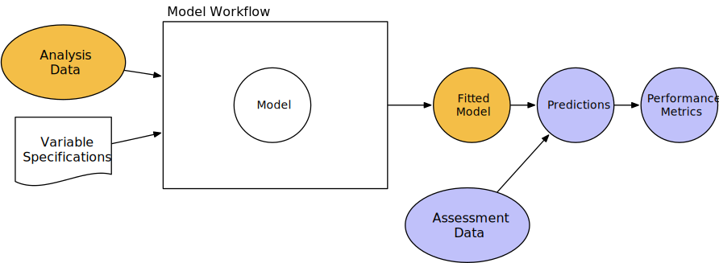
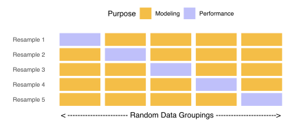
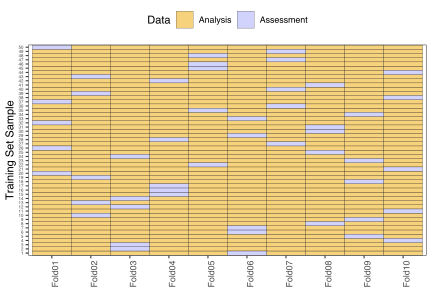

```{r knitr, include = FALSE}
library(knitr)
library(tidyverse)
library(AmesHousing)
ames <- make_ames() %>% 
  dplyr::select(-matches("Qu"))

library(tidymodels)
library(workflows)
library(scico)
library(gganimate)
library(tune)
library(countdown)


opts_chunk$set(digits = 3, fig.path = "images/part-1-")

hexes <- function(x) {
  x <- rev(sort(x))
  markup <- function(pkg) glue::glue('')
  res <- purrr::map_chr(x, markup)
  paste0(res, collapse = "")
}
```

class: title-slide, center


# `r rmarkdown::metadata$title`

## `r rmarkdown::metadata$subtitle`

---

class: inverse, middle, center

# Problems with a single train/test split

# Now that we have fit a model on the _training_ set, is it time to make predictions on the _test_ set?


---

background-size: cover
background-image: url(images/nopestradomis.jpg)


---
exclude: true

```{r include=FALSE}
# make zero correlation variables
set.seed(100)
x <- rnorm(500)

# shuffle x to get y
set.seed(100)
y <- sample(x, size = 500)

# linear combos of x + y
cheese <- x + y
people <- x - y
cor(cheese, people)
uni <- tibble(cheese = cheese, people = people)

# plotting helper functions
plot_sample <- function(sample, title = "Sample") {
  ggplot(uni, aes(x = cheese, y = people)) +
    geom_point(size = 8, color = "gray80", alpha = .5) +
    geom_point(data = sample, 
               size = 8, color = "#46b9d1") +
    coord_cartesian(y = c(-5, 5), x = c(-4, 4)) +
    labs(x = "Per capita cheese consumption",
         y = "Deaths by people being tangled in bedsheets") +
    theme(plot.title = element_text(hjust = 0.5)) + 
    ggtitle(title)
}

plot_sample_lm <- function(sample, title = "Sample") {
  plot_sample(sample, title) +
      geom_smooth(data = sample, method = "lm", se = FALSE, 
                  color = "#bb4b9f", fullrange = TRUE, lwd = 3)
}

plot_sample_poly <- function(sample, title = "Flexible Models") {
  plot_sample_lm(sample, title) +
  #geom_smooth(data = sample, method = "loess", se = FALSE, lwd = 3) +
  stat_smooth(data = sample, 
              method="loess", se = FALSE, span = .5,
              fullrange = TRUE, lwd = 3)
}

plot_resamples <- function(rset, title = "Sample Variation") {
  lm_train <- function(rset) {
      lm(people ~ cheese, analysis(rset))
  }
  
  rset %>% 
      mutate(model = map(splits, lm_train)) %>% 
      mutate(augmented = map(model, augment)) %>% 
      unnest(augmented) %>% 
    ggplot(aes(cheese, people)) +
      geom_point(size = 8, color = "gray80") +
      geom_line(aes(y = .fitted, group = id), 
                colour = "#bb4b9f", alpha=.5, size = 3) +
      coord_cartesian(y = c(-5, 5), x = c(-4, 4)) +
        labs(x = "Per capita cheese consumption",
         y = "Deaths by people being tangled in bedsheets") +
    theme(plot.title = element_text(hjust = 0.5)) +
      ggtitle(title)
}

get_training <- function(rset, resample = 1) {
  rset %>% 
    pluck("splits", resample) %>% 
    analysis()
}

plot_resample <- function(rset, id = "Bootstrap01", title = "Sample Variation") {
  max_point_size <- if_else(str_detect(id, "Bootstrap"), 20, 8)
  
  lm_train <- function(rset) {
      lm(people ~ cheese, analysis(rset))
  }
  
  preds <- rset %>% 
      mutate(model = map(splits, lm_train)) %>% 
      mutate(augmented = map(model, augment)) %>% 
      unnest(augmented)
  
  ggplot(preds, aes(x = cheese, y = people)) +
      geom_point(size = 8, color = "gray80", alpha = .2) +
      geom_count(data = filter(preds, id == {{ id }}), 
                 color = "#46b9d1") +
      geom_line(data = filter(preds, id == {{ id }}),
                 aes(x = cheese, y = .fitted), 
                 colour = "#bb4b9f", size = 3) +
      coord_cartesian(y = c(-5, 5), x = c(-4, 4)) +
    labs(x = "Per capita cheese consumption",
         y = "Deaths by people being tangled in bedsheets") +
    theme(plot.title = element_text(hjust = 0.5))  +   
      ggtitle(title) +
      scale_size_area(max_size = max_point_size, guide = FALSE)
}

plot_tree_resample <- function(rset, id = "Bootstrap01", title = "Sample Variation") {
  lm_train <- function(rset) {
      lm(people ~ cheese, analysis(rset))
  }
  
  rt_train <- function(rset) {
      rpart::rpart(people ~ cheese, 
                   data = analysis(rset))
  }
  
  preds <- rset %>% 
      mutate(model = map(splits, lm_train)) %>% 
      mutate(tree = map(splits, rt_train)) %>% 
      mutate(augmented = map(model, augment)) %>% 
      mutate(.fitted_tree = map(tree, predict)) %>% 
      unnest(c(augmented, .fitted_tree))
  
  ggplot(preds, aes(x = cheese, y = people)) +
      geom_point(size = 8, color = "gray80", alpha = .2) +
      geom_count(data = filter(preds, id == {{ id }}), 
                 color = "#46b9d1") +
      geom_line(data = filter(preds, id == {{ id }}),
                 aes(x = cheese, y = .fitted_tree), 
                 colour = "#bb4b9f", size = 3) +
      coord_cartesian(y = c(-5, 5), x = c(-4, 4)) +
    labs(x = "Per capita cheese consumption",
         y = "Deaths by people being tangled in bedsheets") +
    theme(plot.title = element_text(hjust = 0.5)) +
      ggtitle(title) +
      scale_size_area(max_size = 20, guide = FALSE)
}

plot_tree_resamples <- function(rset, title = "Sample Variation") {
  lm_train <- function(rset) {
      lm(people ~ cheese, analysis(rset))
  }
  
  rt_train <- function(rset) {
      rpart::rpart(people ~ cheese, 
                   data = analysis(rset))
  }
  
  rset %>% 
      mutate(model = map(splits, lm_train)) %>% 
      mutate(tree = map(splits, rt_train)) %>% 
      mutate(augmented = map(model, augment)) %>% 
      mutate(.fitted_tree = map(tree, predict)) %>% 
      unnest(c(augmented, .fitted_tree)) %>% 
    ggplot(aes(cheese, people)) +
      geom_point(size = 8, color = "gray80") +
      geom_line(aes(y = .fitted_tree, group = id), 
                colour = "#bb4b9f", alpha=.5, size = 3) +
      coord_cartesian(y = c(-5, 5), x = c(-4, 4)) +
    labs(x = "Per capita cheese consumption",
         y = "Deaths by people being tangled in bedsheets")
    theme(plot.title = element_text(hjust = 0.5)) +    
      ggtitle(title)
}
```


---

# Imaginary nonsensical dataset

```{r pop-plot, echo = FALSE, out.width= '95%', fig.width=8, fig.height=4, fig.align='center', dev = 'svg', dev.args = list(bg = "transparent"), warning=FALSE}
pop_plot <-
  ggplot(uni, aes(x = cheese, y = people)) +
  geom_point(size = 8, color = "#46b9d1") +
  coord_cartesian(y = c(-5, 5), x = c(-4, 4)) +
      labs(x = "Per capita cheese consumption",
         y = "Deaths by people being tangled in bedsheets") +
    theme(plot.title = element_text(hjust = 0.5)) +
    ggtitle("Population")

pop_plot
```

Deaths by people being tangles in their bedsheets as a function of per-capita cheese consumption. [Source](https://www.tylervigen.com/spurious-correlations)

---

# Fit a linear model on the entire dataset

```{r, echo = FALSE,  out.width= '95%', fig.width=8, fig.height=4, fig.align='center', dev = 'svg', dev.args = list(bg = "transparent"), warning=FALSE}
suppressMessages(print(pop_plot +
  geom_smooth(method = "lm", se = FALSE, 
              color = "#bb4b9f", fullrange = TRUE, lwd = 3)))
```

---

# Pick a sample from this dataset and fit a linear model

```{r, echo = FALSE, out.width = '95%', fig.width=8, fig.height=4, fig.align='center', dev = 'svg', dev.args = list(bg = "transparent"), warning=FALSE}
set.seed(1)
sample_1 <- sample_n(uni, 30)
suppressMessages(print(plot_sample(sample_1, title = "Sample")))
```

---

# Model performs similarly on the sample

```{r, echo = FALSE, out.width = '95%', fig.width=8, fig.height=4, fig.align='center', dev = 'svg', dev.args = list(bg = "transparent"), warning=FALSE}
suppressMessages(print(plot_sample_lm(sample_1, title = "Sample")))
```

---
class: inverse, middle, center

# However...

---

# Picking different samples 

```{r, echo = FALSE, out.width = '95%', fig.width=8, fig.height=4, fig.align='center', dev = 'svg', dev.args = list(bg = "transparent"), warning=FALSE}
set.seed(1)
sample_bias <- uni %>% 
  mutate(weight = case_when(
    cheese < -1 & people > 1 ~ 1,
    cheese > 1 & people < -1 ~ 1,
    TRUE ~ 0)) %>% 
  sample_n(size = 30, weight = weight)

suppressMessages(print(plot_sample(sample_bias, title = "Sample Bias")))
```

---

# Fitting a model

```{r, echo = FALSE, out.width = '95%', fig.width=8, fig.height=4, fig.align='center', dev = 'svg', dev.args = list(bg = "transparent"), warning=FALSE}
suppressMessages(print(plot_sample_lm(sample_bias, title = "Sample Bias")))
```


---

# Picking another sample

```{r, echo = FALSE, out.width = '95%', fig.width=8, fig.height=4, fig.align='center', dev = 'svg', dev.args = list(bg = "transparent"), warning=FALSE}
set.seed(100)
sample_line <- uni %>% 
  mutate(weight = case_when(
    people < -1 & cheese < -1 ~ 1,
    between(people, -1, 0) & between(cheese, -1, 0) ~ 2,
    people > 1 & cheese > 1 ~ 1,
    between(people, 0, 1) & between(cheese, 0, 1) ~ 2,
    TRUE ~ 0)) %>% 
  sample_n(size = 30, weight = weight)

suppressMessages(print(plot_sample(sample_line, title = "Sample Bias")))
```

---

# Fitting model

```{r, echo = FALSE, out.width = '95%', fig.width=8, fig.height=4, fig.align='center', dev = 'svg', dev.args = list(bg = "transparent"), warning=FALSE}
suppressMessages(print(plot_sample_lm(sample_line, title = "Sample Bias")))
```


---
class: middle, center, inverse

# The Solution

Random Sampling

---

```{r, echo = FALSE, out.width = '95%', fig.width=8, fig.height=4, fig.align='center', dev = 'svg', dev.args = list(bg = "transparent"), warning=FALSE}
set.seed(1)
small_samples <- mc_cv(uni, prop = 0.06, times = 25)
```


```{r, echo = FALSE, out.width = '95%', fig.width=8, fig.height=4, fig.align='center', dev = 'svg', dev.args = list(bg = "transparent"), warning=FALSE}
suppressMessages(print(plot_resample(small_samples, id = "Resample02", title = "Random Sample")))
```

---

```{r, echo = FALSE, out.width = '95%', fig.width=8, fig.height=4, fig.align='center', dev = 'svg', dev.args = list(bg = "transparent"), warning=FALSE}
suppressMessages(print(plot_resample(small_samples, id = "Resample03", title = "Random Sample")))
```

---

```{r, echo = FALSE, out.width = '95%', fig.width=8, fig.height=4, fig.align='center', dev = 'svg', dev.args = list(bg = "transparent"), warning=FALSE}
suppressMessages(print(plot_resample(small_samples, id = "Resample04", title = "Random Sample")))
```

---

```{r, echo = FALSE, out.width = '95%', fig.width=8, fig.height=4, fig.align='center', dev = 'svg', dev.args = list(bg = "transparent"), warning=FALSE}
suppressMessages(print(plot_resample(small_samples, id = "Resample05", title = "Random Sample")))
```


---

```{r, echo = FALSE, out.width = '95%', fig.width=8, fig.height=4, fig.align='center', dev = 'svg', dev.args = list(bg = "transparent"), warning=FALSE}
sample_variation <- ggplot(uni, aes(x = cheese, y = people)) +
  geom_point(size = 8, color = "gray80", alpha = .5) +
  geom_smooth(data = get_training(small_samples, 1), method = "lm", se = FALSE, 
              color = "#bb4b9f", fullrange = TRUE, lwd = 3) +
  geom_smooth(data = get_training(small_samples, 2), method = "lm", se = FALSE, 
              color = "#bb4b9f", fullrange = TRUE, lwd = 3) +
  geom_smooth(data = get_training(small_samples, 3), method = "lm", se = FALSE, 
              color = "#bb4b9f", fullrange = TRUE, lwd = 3) +
  geom_smooth(data = get_training(small_samples, 4), method = "lm", se = FALSE, 
              color = "#bb4b9f", fullrange = TRUE, lwd = 3) +
  geom_smooth(data = get_training(small_samples, 5), method = "lm", se = FALSE, 
              color = "#bb4b9f", fullrange = TRUE, lwd = 3) +
  coord_cartesian(y = c(-5, 5), x = c(-4, 4)) +
    labs(x = "Per capita cheese consumption",
         y = "Deaths by people being tangled in bedsheets") +
    theme(plot.title = element_text(hjust = 0.5)) 

suppressMessages(print(sample_variation + 
  ggtitle("Sample Variation")))
```

---

```{r, echo = FALSE, out.width = '95%', fig.width=8, fig.height=4, fig.align='center', dev = 'svg', dev.args = list(bg = "transparent"), warning=FALSE}
suppressMessages(print(plot_resamples(rset = small_samples, title = "Sample Variation")))
```

---
class: middle, center, inverse

# The New Challenge

Sample Variation

---

```{r, echo = FALSE, out.width = '95%', fig.width=8, fig.height=4, fig.align='center', dev = 'svg', dev.args = list(bg = "transparent"), warning=FALSE}
set.seed(1)
big_samples <- mc_cv(uni, prop = 0.6, times = 25)
suppressMessages(print(plot_resample(big_samples, id = "Resample01", title = "Larger N")))
```

---

```{r, echo = FALSE, out.width = '95%', fig.width=8, fig.height=4, fig.align='center', dev = 'svg', dev.args = list(bg = "transparent"), warning=FALSE}
suppressMessages(print(plot_resample(big_samples, id = "Resample02", title = "Larger N")))
```

---

```{r, echo = FALSE, out.width = '95%', fig.width=8, fig.height=4, fig.align='center', dev = 'svg', dev.args = list(bg = "transparent"), warning=FALSE}
suppressMessages(print(plot_resample(big_samples, id = "Resample03", title = "Larger N")))
```

---

```{r, echo = FALSE, out.width = '95%', fig.width=8, fig.height=4, fig.align='center', dev = 'svg', dev.args = list(bg = "transparent"), warning=FALSE}
suppressMessages(print(plot_resample(big_samples, id = "Resample04", title = "Larger N")))
```

---

```{r, echo = FALSE, out.width = '95%', fig.width=8, fig.height=4, fig.align='center', dev = 'svg', dev.args = list(bg = "transparent"), warning=FALSE}
suppressMessages(print(plot_resample(big_samples, id = "Resample05", title = "Larger N")))
```

---
```{r, echo = FALSE, out.width = '95%', fig.width=8, fig.height=4, fig.align='center', dev = 'svg', dev.args = list(bg = "transparent"), warning=FALSE}
# get_training(small_samples, 1)
# get_training(big_samples, 1)

suppressMessages(print(ggplot(uni, aes(x = cheese, y = people)) +
  geom_point(size = 8, color = "gray80", alpha = .5) +
  geom_smooth(data = get_training(big_samples, 1), method = "lm", se = FALSE, 
              color = "#bb4b9f", fullrange = TRUE, lwd = 2, alpha = .2) +
  geom_smooth(data = get_training(big_samples, 2), method = "lm", se = FALSE, 
              color = "#c15da8", fullrange = TRUE, lwd = 2, alpha = .2) +
  geom_smooth(data = get_training(big_samples, 3), method = "lm", se = FALSE, 
              color = "#c86eb2", fullrange = TRUE, lwd = 2, alpha = .2) +
  geom_smooth(data = get_training(big_samples, 4), method = "lm", se = FALSE, 
              color = "#cf81bb", fullrange = TRUE, lwd = 2, alpha = .2) +
  geom_smooth(data = get_training(big_samples, 5), method = "lm", se = FALSE, 
              color = "#d693c5", fullrange = TRUE, lwd = 2, alpha = .2) +
  coord_cartesian(y = c(-5, 5), x = c(-4, 4)) +
    labs(x = "Per capita cheese consumption",
         y = "Deaths by people being tangled in bedsheets") +
    theme(plot.title = element_text(hjust = 0.5)) +  
  ggtitle("Larger N")))
```

---

```{r, echo = FALSE, out.width = '95%', fig.width=8, fig.height=4, fig.align='center', dev = 'svg', dev.args = list(bg = "transparent"), warning=FALSE}
suppressMessages(print(plot_resamples(rset = big_samples, title = "Larger N")))
```

---

```{r, echo = FALSE, out.width = '95%', fig.width=8, fig.height=4, fig.align='center', dev = 'svg', dev.args = list(bg = "transparent"), warning=FALSE}
suppressMessages(print(plot_sample_poly(get_training(small_samples, 1))))
```

---

```{r, echo = FALSE, out.width = '95%', fig.width=8, fig.height=4, fig.align='center', dev = 'svg', dev.args = list(bg = "transparent"), warning=FALSE}
suppressMessages(print(plot_sample_poly(get_training(small_samples, 2))))
```

---

```{r, echo = FALSE, out.width = '95%', fig.width=8, fig.height=4, fig.align='center', dev = 'svg', dev.args = list(bg = "transparent"), warning=FALSE}
suppressMessages(print(plot_sample_poly(get_training(small_samples, 3))))
```

---

```{r, echo = FALSE, out.width = '95%', fig.width=8, fig.height=4, fig.align='center', dev = 'svg', dev.args = list(bg = "transparent"), warning=FALSE}
suppressMessages(print(plot_sample_poly(get_training(small_samples, 4))))
```

---

```{r, echo = FALSE, out.width = '95%', fig.width=8, fig.height=4, fig.align='center', dev = 'svg', dev.args = list(bg = "transparent"), warning=FALSE}
suppressMessages(print(plot_sample_poly(get_training(small_samples, 5))))
```

---
```{r, echo = FALSE, out.width = '95%', fig.width=8, fig.height=4, fig.align='center', dev = 'svg', dev.args = list(bg = "transparent"), warning=FALSE}
suppressMessages(print(sample_variation + 
  stat_smooth(data = get_training(small_samples, 1), 
              method="loess", se = FALSE, span = .5,
              fullrange = TRUE, lwd = 3) +
  stat_smooth(data = get_training(small_samples, 2), 
              method="loess", se = FALSE, span = .5,
              fullrange = TRUE, lwd = 3) +
  stat_smooth(data = get_training(small_samples, 3), 
              method="loess", se = FALSE, span = .5,
              fullrange = TRUE, lwd = 3) +
  stat_smooth(data = get_training(small_samples, 4), 
              method="loess", se = FALSE, span = .5,
              fullrange = TRUE, lwd = 3) +
  stat_smooth(data = get_training(small_samples, 5), 
              method="loess", se = FALSE, span = .5,
              fullrange = TRUE, lwd = 3) +
  ggtitle("Flexible Models")))
```


---
class: middle, center, inverse

# The good news

You don't have to collect more data.

You don't have to sacrifice fit for flexibility.

---

```{r, echo = FALSE, out.width = '95%', fig.width=8, fig.height=4, fig.align='center', dev = 'svg', dev.args = list(bg = "transparent"), warning=FALSE}
set.seed(1)
boots <- bootstraps(sample_1, times = 25)
suppressMessages(print(plot_resample(boots, id = "Bootstrap01", title = "Bootstrapped Sample")))
```

---

```{r, echo = FALSE, out.width = '95%', fig.width=8, fig.height=4, fig.align='center', dev = 'svg', dev.args = list(bg = "transparent"), warning=FALSE}
suppressMessages(print(plot_resample(boots, id = "Bootstrap05", title = "Bootstrapped Sample")))
```

---

```{r, echo = FALSE, out.width = '95%', fig.width=8, fig.height=4, fig.align='center', dev = 'svg', dev.args = list(bg = "transparent"), warning=FALSE}
suppressMessages(print(plot_resample(boots, id = "Bootstrap10", title = "Bootstrapped Sample")))
```

---

```{r, echo = FALSE, out.width = '95%', fig.width=8, fig.height=4, fig.align='center', dev = 'svg', dev.args = list(bg = "transparent"), warning=FALSE}
suppressMessages(print(plot_resample(boots, id = "Bootstrap12", title = "Bootstrapped Sample")))
```

---

```{r, echo = FALSE, out.width = '95%', fig.width=8, fig.height=4, fig.align='center', dev = 'svg', dev.args = list(bg = "transparent"), warning=FALSE}
suppressMessages(print(plot_resample(boots, id = "Bootstrap18", title = "Bootstrapped Sample")))
```

---

```{r, echo = FALSE, out.width = '95%', fig.width=8, fig.height=4, fig.align='center', dev = 'svg', dev.args = list(bg = "transparent"), warning=FALSE}
suppressMessages(print(plot_resample(boots, id = "Bootstrap21", title = "Bootstrapped Sample")))
```

---

```{r, echo = FALSE, out.width = '95%', fig.width=8, fig.height=4, fig.align='center', dev = 'svg', dev.args = list(bg = "transparent"), warning=FALSE}
suppressMessages(print(plot_resample(boots, id = "Bootstrap25", title = "Bootstrapped Sample")))
```

---

```{r, echo = FALSE, out.width = '95%', fig.width=8, fig.height=4, fig.align='center', dev = 'svg', dev.args = list(bg = "transparent"), warning=FALSE}
suppressMessages(print(plot_resamples(rset = boots, title = "Bootstraps") ))
```


---
class: middle

```{r, echo = FALSE, out.width = '48%', fig.show='hold', fig.align = "default", fig.asp=1}
suppressMessages(print(plot_resamples(rset = small_samples, title = "Many samples") +
  geom_smooth(method = "lm", data = uni, size = 3)))
suppressMessages(print(plot_resamples(rset = boots, title = "One Sample, Many bootstraps") +
  geom_smooth(method = "lm", data = uni, size = 3)))
```

---
class: middle

```{r, echo = FALSE, out.width = '48%', fig.show='hold', fig.align = "default", fig.asp=1}
set.seed(1)
big_boots <- bootstraps(get_training(big_samples, 1), times = 25) 
suppressMessages(print(plot_resamples(rset = big_samples, title = "Many bigger samples") +
  geom_smooth(method = "lm", data = uni, size = 3)))
suppressMessages(print(plot_resamples(rset = big_boots, title = "One bigger sample, Many bootstraps")  +
  geom_smooth(method = "lm", data = uni, size = 3)))
```

---

```{r, echo = FALSE, out.width = '95%', fig.width=8, fig.height=4, fig.align='center', dev = 'svg', dev.args = list(bg = "transparent"), warning=FALSE}
set.seed(1)
library(infer)
boot_train <- uni %>%
   specify(people ~ cheese) %>% 
   generate(reps = 1000, type = "bootstrap") %>%
   calculate(stat = "correlation")
percentile_ci <- get_ci(boot_train)
visualize(boot_train) +
  shade_confidence_interval(endpoints = percentile_ci, fill = "#bb4b9f", color = "#bb4b9f") +
    labs(x = "Per capita cheese consumption",
         y = "Deaths by people being tangled in bedsheets") +
    theme(plot.title = element_text(hjust = 0.5)) +
  coord_cartesian(x = c(-.5, .5))
```

---

```{r, echo = FALSE, out.width = '95%', fig.width=8, fig.height=4, fig.align='center', dev = 'svg', dev.args = list(bg = "transparent"), warning=FALSE}
suppressMessages(print(plot_resamples(rset = boots, title = "Averaging Reduces Variance") +
  stat_summary(aes(y = .fitted), fun.y = "mean", 
               colour = "navy", size = 3, geom = "line")))
```

---

```{r, echo = FALSE, out.width = '95%', fig.width=8, fig.height=4, fig.align='center', dev = 'svg', dev.args = list(bg = "transparent"), warning=FALSE}
biased_boots1 <- bootstraps(sample_bias, times = 25)
suppressMessages(print(plot_resamples(rset = biased_boots1, title = "Still biased!") +
  stat_summary(aes(y = .fitted), fun.y = "mean", 
               colour = "navy", size = 3, geom = "line")))
```

---

```{r, echo = FALSE, out.width = '95%', fig.width=8, fig.height=4, fig.align='center', dev = 'svg', dev.args = list(bg = "transparent"), warning=FALSE}
biased_boots2 <- bootstraps(sample_line, times = 25)
suppressMessages(print(plot_resamples(rset = biased_boots2, title = "Still biased!") +
  stat_summary(aes(y = .fitted), fun.y = "mean", 
               colour = "navy", size = 3, geom = "line")))
```

---

# The modeling _process_

Common steps during model building are:

* estimating model parameters (i.e. training models)

* determining the values of _tuning parameters_ that cannot be directly calculated from the data

* model selection (within a model type) and model comparison (between types)

* calculating the performance of the final model that will generalize to new data

Many books and courses portray predictive modeling as a short sprint. A better analogy would be a marathon or campaign (depending on how hard the problem is). 


---

# What the modeling process usually looks like

```{r mod-process, echo = FALSE, out.width = '95%', fig.width=8, fig.height=2.5, fig.align='center', dev = 'svg', dev.args = list(bg = "transparent"), warning=FALSE}
widths <- c(8, 4, 10, 2, 6, 6, 
            rep(1, 19), 2,
            rep(1, 19), 2,
            rep(1, 19), 2,
            rep(1, 19), 2,
            4, 8, 15,
            rep(1, 29), 6,
            rep(1, 29), 4,
            1)
srt <- c(1, cumsum(widths))
stp <- srt[-1]
srt <- srt[-length(srt)]

diag_cols <- c(EDA = "#377EB8", "Quantitative Analysis" = "#A6CEE3", 
               "Feature Engineering" = "#4DAF4A", "Model Fit" = "#E41A1C", 
               "Model Tuning" = "grey")

bar_loc <- data.frame(srt = srt,
                  stp = stp,
                  g = c("EDA", "Quantitative Analysis", "EDA", "Quantitative Analysis", "EDA", "Feature Engineering", 
                        rep(c("Model Fit", "Model Tuning"), 40),
                        "Quantitative Analysis", "EDA", "Feature Engineering",
                        rep(c("Model Fit", "Model Tuning"), 14), "Model Fit", "Feature Engineering",
                        rep(c("Model Fit", "Model Tuning"), 14), "Model Fit", "Quantitative Analysis",
                        "Model Fit"))
bar_loc$ytop <- 1.9
bar_loc$ybot <- 1
bar_loc$g <- factor(as.character(bar_loc$g), 
                levels = c("EDA", "Quantitative Analysis", "Feature Engineering",
                           "Model Fit", "Model Tuning"))
text_loc <- data.frame(x = c(1, 8, 30, 36, 120, 124, 132, 147, 211, 215)+1,
                       y = 2.1)
text_loc$label <- letters[1:nrow(text_loc)]

mod_loc <- data.frame(x = c(45, 66, 87, 107, 162, 195)+1,
                      y = .75, 
                      label = c("Model\n#1", "Model\n#2", "Model\n#3", "Model\n#4",
                                "Model\n#2", "Model\n#4"))
library(ggplot2)
time_spent <- ggplot(bar_loc) + 
  geom_rect(aes(fill = g, xmin = srt, xmax = stp,
                ymin = ybot, ymax = ytop), alpha = .7)  + 
  theme(
    legend.position = "bottom",
    legend.background = element_blank(),
    axis.line = element_blank(),
    axis.text.x = element_blank(),
    axis.text.y = element_blank(),
    axis.ticks = element_blank(),
    axis.title.x = element_text(hjust = .05),
    axis.title.y = element_blank(),
    panel.background = element_blank(),
    panel.border = element_blank(),
    panel.grid.major = element_blank(),
    panel.grid.minor = element_blank(),
    plot.background = element_blank()
    ) +
  scale_fill_manual(values = diag_cols, name = "") +
  geom_text(data = text_loc, aes(x = x, y = y, label = label)) + 
  geom_text(data = mod_loc, aes(x = x, y = y, label = label), size = 3) +   
  xlab("Time") + 
  ylim(c(.5, 2.25))
time_spent
```


---

# What are we doing with the data?


.pull-left[
We often think of the model as the _only_ real data analysis step in this process.

However, there are other procedures that are often applied before or after the model fit that are data-driven and have an impact. 

If we only think of the model as being important, we might end up accidentally overfitting to the data in-hand. 
]
.pull-right[

```{r simple-proc, echo = FALSE, out.width = '75%', fig.align='center', dev = 'svg', dev.args = list(bg = "transparent"), warning=FALSE}
knitr::include_graphics("images/diagram-simple.svg")
```

]


---

# Define the data analysis process

.pull-left[
Let's conceptualize a process or _workflow_ that involves all of the steps where the data are analyzed in a significant way. The includes the model but might also include other _estimation_ steps:

 * data preparation steps (e.g. imputation, encoding, transformations, etc)
 
 * selection of which terms go into the model

and so on. 

Admittedly, there is some grey area here. 

]
.pull-right[


```{r realistic-proc, echo = FALSE, out.width = '95%', fig.align='center', dev = 'svg', dev.args = list(bg = "transparent"), warning=FALSE}

```

This concept will become important when we talk about measuring performance of the modeling process. 

]
 
---

# Some naming conventions

There are a few suffixes that we'll use for certain types of objects:

 * `_mod` for a `parsnip` model specification
 
 * `_fit` for a fitted model
 
 * `_rec` for a recipe
 
 * `_wfl` for a workflow
 
 * `_tune` for a tuning object
 
 * `_res` for a general result
 

---

# The `parsnip` package (part of `tidymodels`)


 * A tidy unified _interface_ to models
 
 * `lm()` isn't the only way to perform linear regression
 
    * `glmnet` for regularized regression
    
    * `stan` for Bayesian regression
    
    * `keras` for regression using tensorflow
    
    * `spark` for large datasets

 * Each interface has it's own syntax

---

```{r, eval=TRUE, include=FALSE}
set.seed(4595)
data_split <- initial_split(ames, strata = "Sale_Price")

ames_train <- training(data_split)
ames_test  <- testing(data_split)
```

# `parsnip` in action

.pull-left[

1) Create a specification

```{r}
spec_lin_reg <- linear_reg()
spec_lin_reg
```

2) Set the engine

```{r}
lm_mod <- set_engine(spec_lin_reg, "lm")
lm_mod
```
]

.pull-right[

3) Fit the model

```{r}
lm_fit <- fit(
  lm_mod,
  log10(Sale_Price) ~ Longitude + Latitude,
  data = ames_train
)
lm_fit
```

]


---

# Different interfaces

`parsnip` is not picky about the interface used to specify terms.

```{r}
ames_train_log <- ames_train %>%
  mutate(Sale_Price_Log = log10(Sale_Price))

fit_xy(
  lm_mod,
  y = ames_train_log$Sale_Price_Log,
  x = ames_train_log %>% dplyr::select(Latitude, Longitude)
)
```


---

# Alternative engines

With `parsnip` it is easy to switch to a different engine, like Stan (which does Bayesian statistics) and run the same model.

.pull-left[
```{r}
spec_stan <- 
  spec_lin_reg %>%
  # Engine specific arguments are passed through here
  set_engine("stan", chains = 4, iter = 1000)

# Otherwise, looks exactly the same!
fit_stan <- fit(
  spec_stan,
  log10(Sale_Price) ~ Longitude + Latitude,
  data = ames_train
)
```
]


.pull-right[
Results are the _almost_ identical:

```{r}
coef(fit_stan$fit)
```

```{r}
coef(lm_fit$fit)
```
]

---

# Different models

Switching _between_ models is easy since the interfaces are homogeneous.

For example, to fit a 5-nearest neighbor model:

```{r}
fit_knn <- 
  nearest_neighbor(mode = "regression", neighbors = 5) %>%
  set_engine("kknn") %>% 
  fit(log10(Sale_Price) ~ Longitude + Latitude, data = ames_train)

fit_knn
```


---

# Back to the process

```{r , echo = FALSE, out.width = '95%', fig.width=8, fig.height=2.5, fig.align='center', dev = 'svg', dev.args = list(bg = "transparent"), warning=FALSE}
time_spent
```

---

class: inverse, middle, center

# Resampling

---

# Resampling methods

.pull-left[
These are additional data splitting schemes that are applied to the _training_ set and are used for **estimating model performance.**

They attempt to simulate slightly different versions of the _training_ set. These versions of the original are split into two model subsets:

* The _analysis set_ is used to fit the model (analogous to the _training_ set)

* Performance is determined using the _assessment set_ (analogous to the _testing_ set)

The process is repeated many times.
]

.pull-right[
```{r resampling, echo = FALSE, out.width = '75%', fig.align='center', dev = 'svg', dev.args = list(bg = "transparent"), warning=FALSE}

```
]

---

# The model workflow and resampling

All respampling methods repeat this process multiple times:
```{r diagram-resampling, echo = FALSE, out.width = '75%', fig.align='center', dev = 'svg', dev.args = list(bg = "transparent"), warning=FALSE}

```

The final resampling estimate is the average of all the estimated metrics.


---

# V(_or K_)-Fold Cross Validation

.pull-left[
Here we randomly split the _training_ data into _V_ distinct blocks of roughly equal size ("the folds").

* We leave out the first block of _analysis_ data and fit a model

* This model is used to predict the held-out block of assesment data

* We continue this process until we've predicted all V assessment blocks

The final performance is based on the hold-out predictions by _averaging_ the statistics from the V(_or K_) blocks
]

.pull-right[
```{r , echo = FALSE, out.width = '75%', fig.align='center', dev = 'svg', dev.args = list(bg = "transparent"), warning=FALSE}

```

_V_ is usually taken to be 5 or 10 leave-one-out cross-validation (LOOCV).

**Repeated CV** can be used when training sizes are small. 5 repeats of 10-fold CV provides 50 metrics to average.
]

---

# 10-Fold Cross Validation with _n_ = 50

```{r, echo = FALSE, out.width = '75%', fig.align='center', dev = 'svg', dev.args = list(bg = "transparent"), warning=FALSE}

```


---

# Resampling results

**The goal of resampling is to produce a single estimate of the performance of a model.**

Even though we end up estimating _V_ models (for V-fold CV), these models are discarded after we have our performance estimate.

The ultimate goal is to use a model in order to get _predictions_ on _*new data*_ or forecast some event in future with _*unseen*_ data. A good model is not the one that gives accurate predictions on the known data _training data_ but the one which gives good predictions on new data and avoids _overfitting and underfitting_.

Resampling is basically an _empirical simulation_ used to understand how well a model would work on _new data_.


---

# Cross Validation using `rsample` (part of `tidymodels`)

`rsample` has a number of resampling functions built-in. One is `vfold_cv()` for performing V-Fold cross validation:

```{r}
set.seed(2453)
cv_splits <- vfold_cv(ames_train) #10-fold is default
cv_splits
```


---

# Cross Validation using `rsample` (part of `tidymodels`)

* Each individual split object is similar to the `initial_split()` example.

* Use `analysis()` to extract the resampled block of data for the _fitting_ process

* Use `assessment()` to extract the resampled block of data for the _performance_ process.


.pull-left[

`cv_splits` is a `tibble` with `list` objects.

```{r}
cv_splits$splits[[1]]
```
]


.pull-right[

```{r}
cv_splits$splits[[1]] %>% analysis() %>% dim()
cv_splits$splits[[1]] %>% assessment() %>% dim()
```
]

