class: inverse, center, middle

# Machine Learning Process

---

## The Ml Landscape 

.center[

]

---

## What the Modeling Process Usually Looks Like

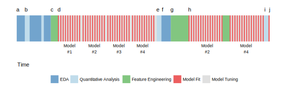

---

.center[
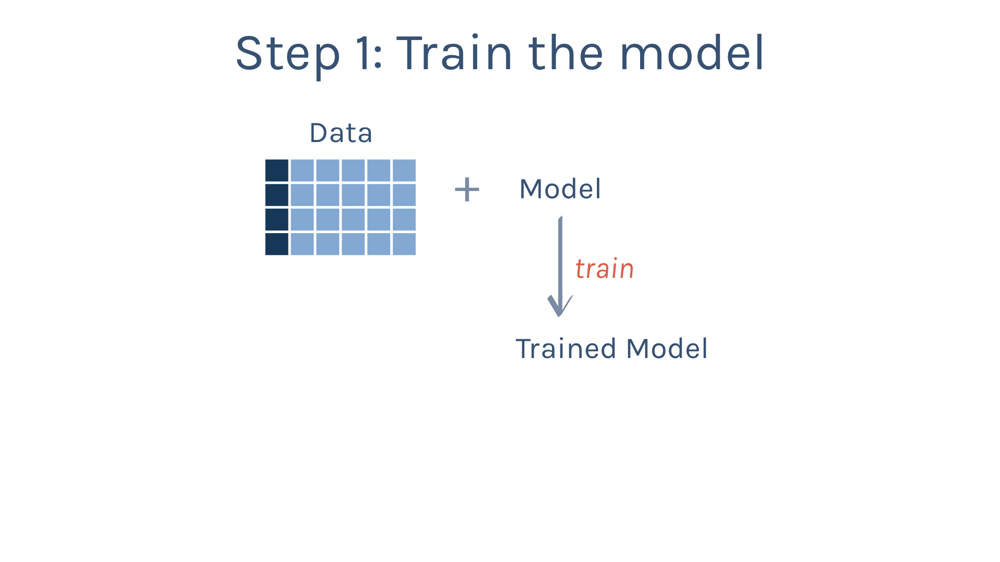
]

---

.center[
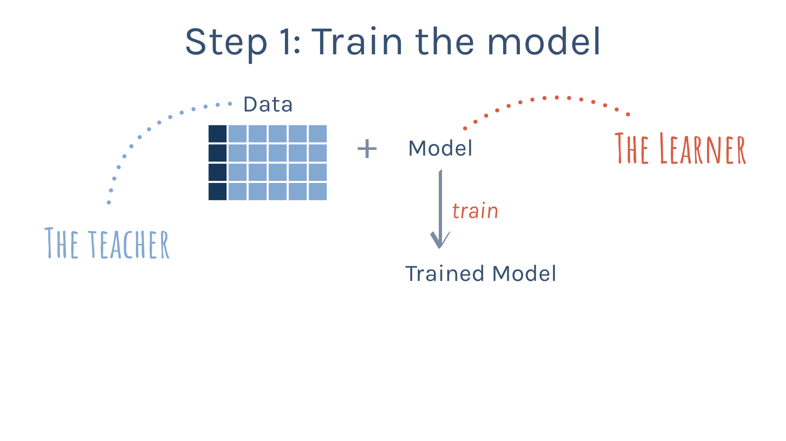
]
---

.center[
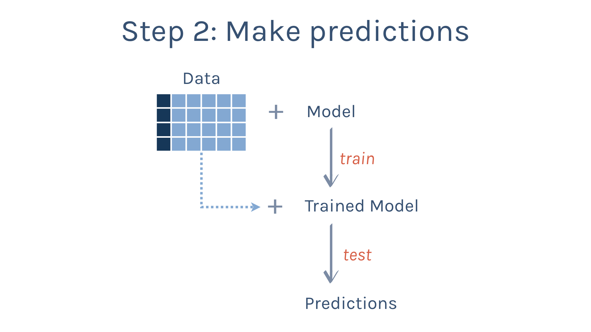
]

---

.center[
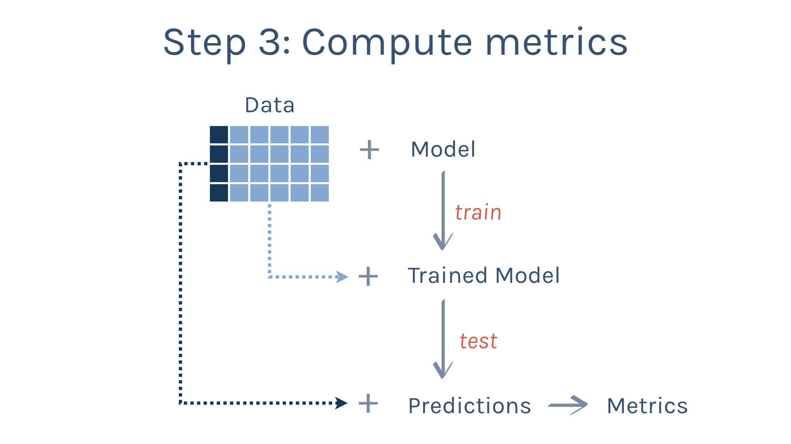
]
---

.center[
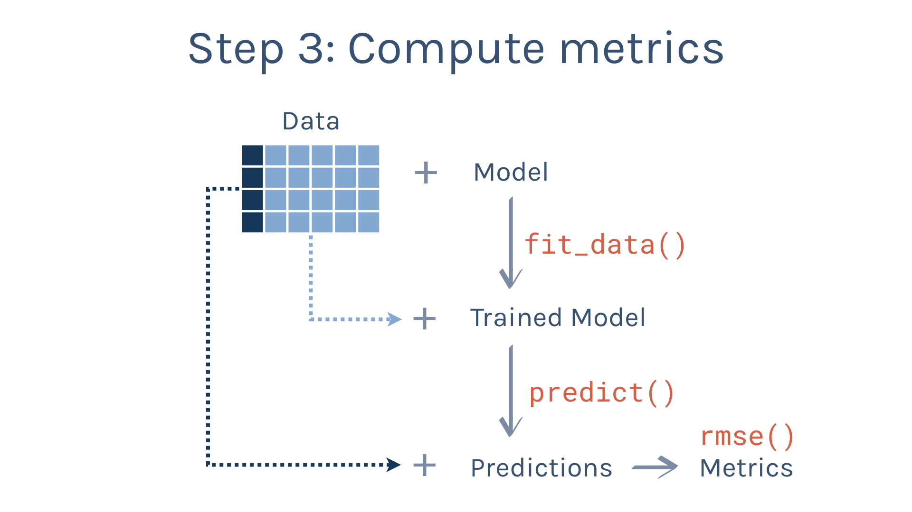
]

---

.center[
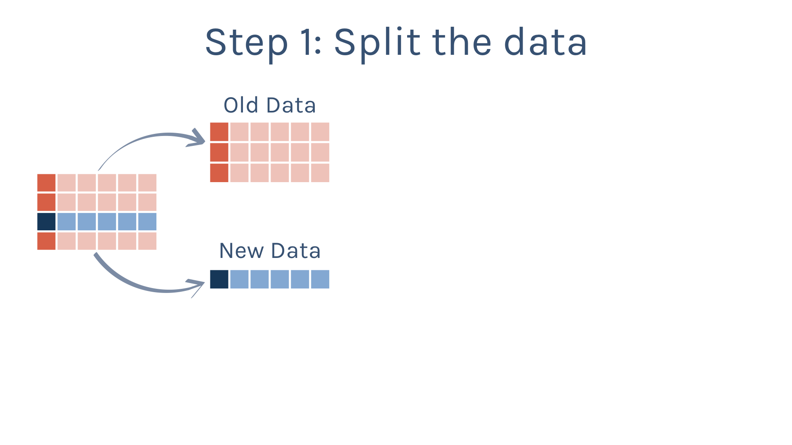
]

---

## Another view of the training/testing split:

.center[

]

---

.center[
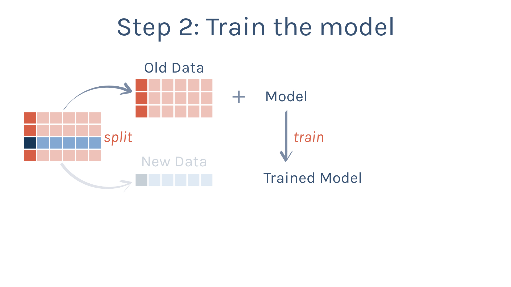
]

---
.center[
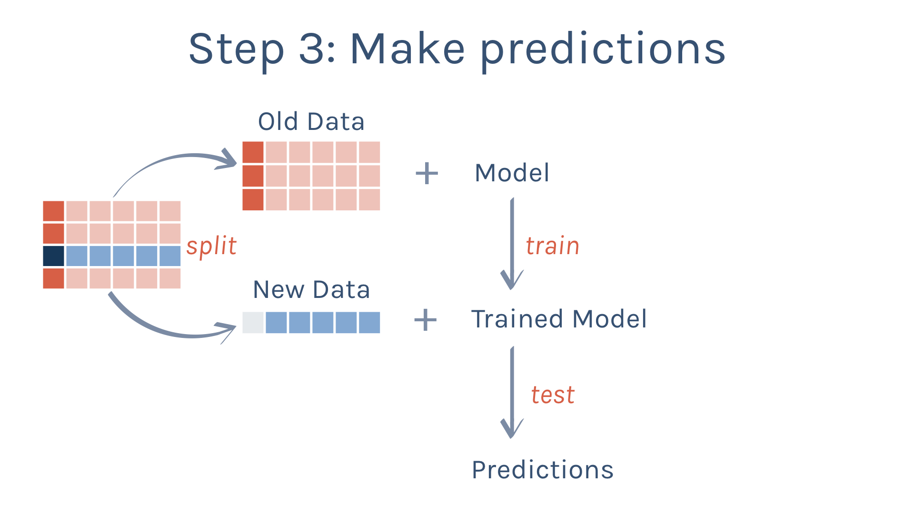
]

---
.center[
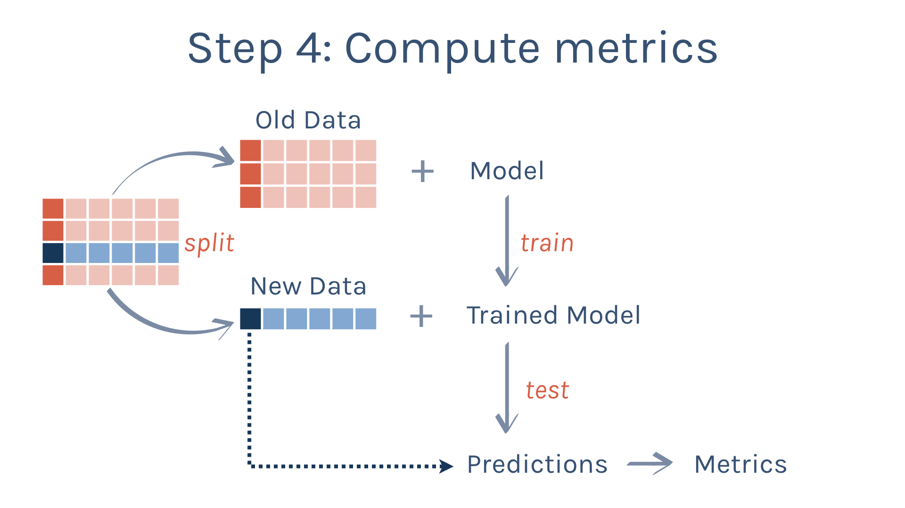
]

---
.center[
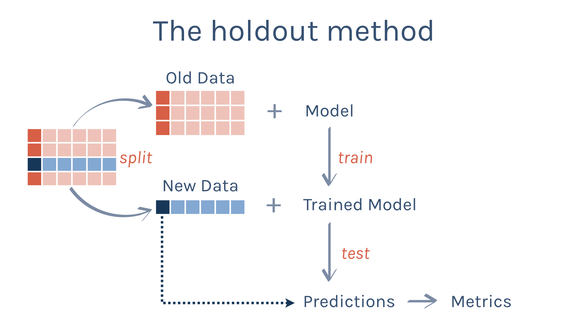
]

---
.center[
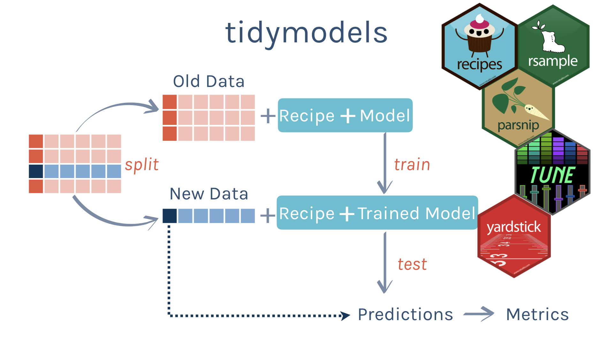
]

---
.center[
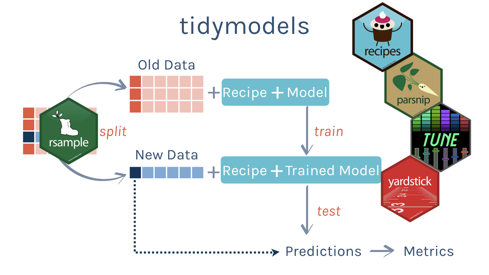
]

---
.center[
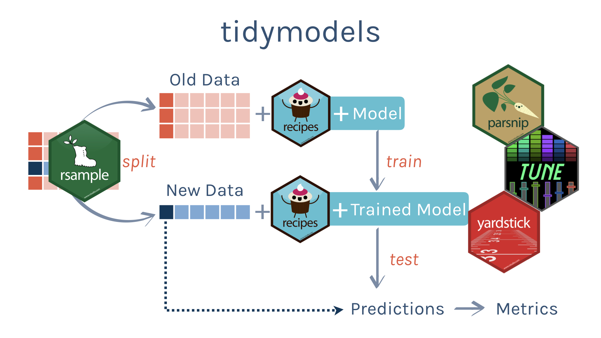
]

---
.center[
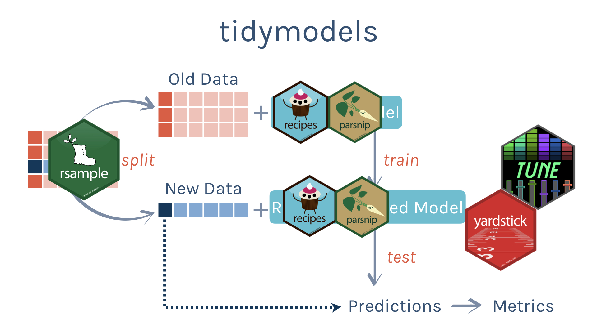
]

---
.center[
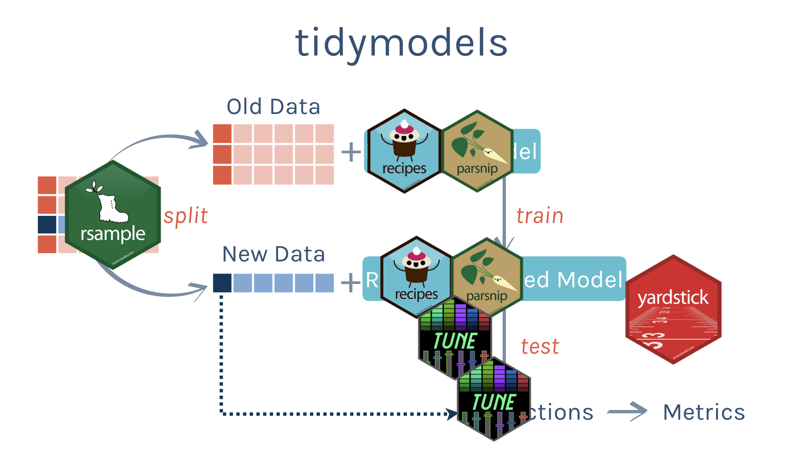
]

---
.center[
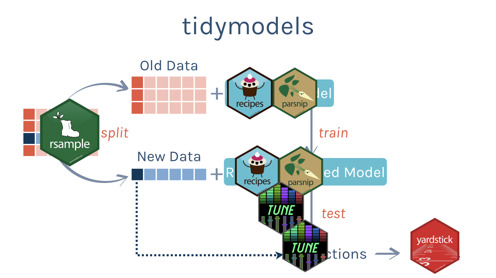
]

---

.center[

]

---

.center[

]
